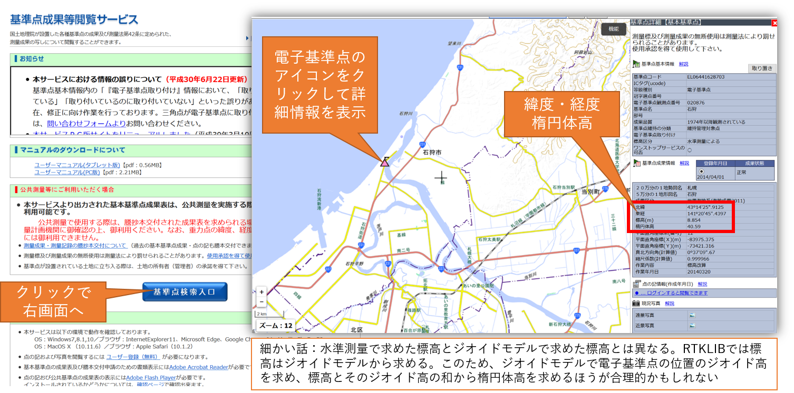

# 1.planning
**"Success (and failure) is promised at that moment."**

## introduction

What are we doing in RTKLIB with the Base and Rover data observed by GNSS?  
- We're finding the baseline vector.
  - Baseline Vector: Three-dimensional positional relationship between Base and Rover (distance and orientation)
  - Rover's coordinates are obtained indirectly using the results of baseline vector analysis

- Process to obtain the coordinates of Rover
  1. find the baseline vector from Base to Rover
  2. find the coordinates of Rover with the Base coordinates as the origin
  3. transformation of coordinates according to the output coordinate system set by the user
  4. output Rover coordinates to analysis results (.pos file)
- The positional relationship (baseline vector) between Base and Rover is constant regardless of the Base coordinates. In other words, if there is an error (misalignment) in the Base coordinate, the Rover coordinate also has the same misalignment. 
- If you want to get the absolute coordinates of Rover, you need to get the absolute coordinates of Base
  - Absolute coordinates of the Base: To be precise, the coordinates of the antenna phase center of the Base (not the coordinates of the ground where the Base is placed)

## basic terms

- L1-DGNSS: Relative positioning using the L1 band carrier (around 1542 MHz) 
- Base: Reference station (fixed station)
- Rover: mobile station
- GNSS-based Control Station: Reference points using GNSS maintained by the Geospatial Information Authority of Japan (GSI)
- Known points: Reference points that are maintained by the GSI and whose survey results are available to the public
- Baseline length: straight line between Base and Rover
- Baseline Vector: Three-dimensional positional relationship between Base and Rover (distance and orientation)
- PPK: Post processing kinematic. The process of analyzing the baseline vector of Rover, in which Rover is a kinematic (moving body) or the static (fixed position). In either case of kinematic or static, we call it PPK.
- Absolute Coordinates: unique coordinate values in geographic space
- Single Solution: Single positioning solution using code signals (same method as general GNSS loggers)

## planning

### considering the placement of Base
- Open sky: sky is physically visible. Check the direction from which most satellites fly during the observation period.
- GDOP (next page): Checking the status of the satellite configuration during the observation period
- [GNSS Radar](http://www.taroz.net/GNSS-Radar.html)

- DOP: Dilution of precision, The degree of loss of positioning accuracy that varies with satellite positioning
- GDOP: Geometric DOP, see this value for planning
- PDOP: Position DOP
- VDOP: Vertical DOP
- HDOP: Horizontal DOP, used for UAV flight planning

### Choosing how to get the absolute coordinates of the Base `[Important] Baseline vector is constant regardless of the Base coordinates`.
1. to place it on a known point (no need to get the Base coordinates by measuring)
2. obtain Base coordinates from the reference point (GNSS-based Control Station) using PPK (the Control Station is set as Base, while user Base is set as Rover for PPK analysis)
3. measure the known point with Rover and calculate the Base coordinates backwards
4. in case precise absolute coordinates of the Base are not required, single solution as Base coordinates (same as a general GNSS logger).
  - PPP may also be applied to enhance the accuracy of single solution!

### Selecting GNSS-based Control Station and Known Points
1. Confirmation of nearby Control Station and baseline lengths (check multiple locations)
2. Confirmation of known points and baseline lengths in the neighborhood (check multiple points, select points for maintenance or viewing. Select a point for maintenance or viewing)
- GSI ["Control Point Survey Results Browsing Service"](https://sokuseikagis) 1.gsi.go.jp/top.html)

### Known points are selected including the spare.
** Known points are not always available (read carefully "Point Notation Information (点の記)")**.
- There are numerous reasons why you can't measure it. Better to have a couple of spare points.
- The protective frame has been moved and the pillar stones are leaning
- The installation of the pillar stones has become unstable or
- There are tall trees and buildings in the surroundings (interference with GNSS signal reception)
- It can be incorporated into the structure (how do you measure...?)
- Deeply buried in vegetation, fallen leaves, and sediment (we'll start with cleaning...)
- It doesn't exist... etc...

### Use of GNSS-based Control Station Data.
**If you want to find the coordinates of Base with the Control Station data**
1. obtain the GNSS-based Control Station RINEX file
  - GSI [website for "GNSS-based Control Station Data Providing Service"](http:// terras.gsi.go.jp/)
  - User registration for the GSI Common Login Management System is required.
  - Web browser version and FTP version of the account are separate

  - tar, gz compressed are available as they are in RTKLIB
  - The "Daily Data" can be downloaded after 2 days

**Download PCV correction data (GSI_PCV.TXT)**.

- For RTKLIB, you can change the extension to ".pcv" for smooth recognition

2. examine the measurement results (coordinate values) of a GNSS-based Control Station
  - GSI ["Control Point Survey Results Browsing Service"](https://sokuseikagis1.gsi.go.jp/top.html)
  - Coordinates required for RTKLIB analysis are latitude, longitude, and ellipsoid height (NOT elevation)
  - GSI ["Geoid Height Calculation"](https://vldb.gsi.go.jp/sokuchi/surveycalc/geoid/calcgh/calcframe. html)
  - The coordinates required for RTKLIB processing are latitude and **ellipsoid height** (NOT elevation)

- RINEX: Receiver Independent Exchange Format, a generic format for GNSS receivers
- Elevation = Ellipsoid height - Gioid height
- Ellipsoid Height: the height required by GNSS. The difference between the distance from the center of the Earth at a given point and the modeled shape of the Earth (the ellipsoid)
- Geoid: The "isopotential plane of gravity" closest to the mean position of the sea surface. Elevation is the height measured from the geoid
