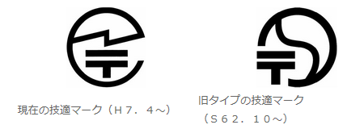
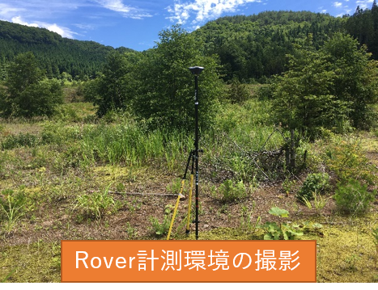
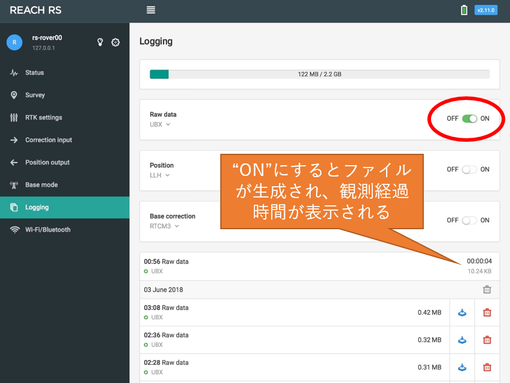
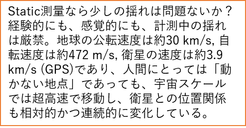

# 2. 測量

**“誤差が大きい？高精度だよ。ポールの傾きがよく出ている“**

---

## 測量の前に…：その機材、電波法に適合していますか？

- 電波法への準拠
- 技術基準適合証明等のマーク（技適マーク）がない機器を使用すると違法になるおそれがある
  - 例）海外製（個人輸入、業者が少量を輸入）
  - 例）最新の機器（技適申請が完了していないかもしれない）

  - 総務省[「電波利用ホームページ」](http://www.tele.soumu.go.jp/j/adm/monitoring/summary/qa/giteki_mark/)の解説を参照
- 同ページにて[技術基準適合証明等を受けた機器](http://www.tele.soumu.go.jp/giteki/SearchServlet?pageID=js01)の検索が可能
- EMLID社のReach RS, Reach RTKは国内使用可能
  - 基盤がIntel Edison（工事設計認証番号007-AC0199）のため、そのまま利用可能

- 同社の新製品Reach RS+, Reach M+は技適申請が完了していない
  - 国内で使用すると違法。一年以下の懲役又は百万円以下の罰金（電波法第110条）

## L1-DGNSSとRTKLIBによるPPK解析：測量
**測量（現地作業）**
1. 取得する測位衛星システムと頻度の設定
    - 標準は、GPS, GLONASS, QZSS, 5 Hz
    - 移動体の場合、頻度を上げると小さい動きも再現できる（かも）
      - 10 m/sで飛行するUAVの場合、5 Hzでは2mごとの計測となる
      - 取得する測位衛星システムの種類や頻度を上げるとデータ量が増える
      - BeiDou（中国）は日本上空の飛来数が多いが、電子基準点で取得していない
2. Baseの設置、観測開始
    - Baseの最短観測時間の目安：電子基準点からの基線長（km）×10分（最短45分）
    - 通常、Rover観測作業中に十分に長い時間の観測が可能
3. 測量地点にRoverを設置し、観測を開始
    - Roverの観測時間：3分～
    - 開空率が低い、基線長が長い、薄い植生の遮蔽、GDOPが高い場合は時間を延長
4. Baseの観測終了

## Base/Roverの設置と観測の一般的な注意事項
- **Base**
  - 開空率が高く、揺れず、出入りがない場所

- **Rover**
    - バイポッドは風向きに正対して設置する
    - 風が強い日はポールに手を添えておく

## Roverの設置と観測
**Roverの設置と観測（EMLID Reach RS/RTKでの操作例）**
1. 測量地点にRoverを設置（可能な限り、厳密に垂直に）
    - 2 mのポールが20分（0.33度）傾いた場合、水平方向に1.3 cmの誤差が生じる
    - 精密かつキャリブレーションされたポールを使用する
    - 設置は慎重、丁寧に！！
    - 気泡管を斜め上から見ているようではNG
2. 観測を開始（Raw dataを”on”）
    - 風による転倒、揺れを警戒
3. 写真撮影
    - 計測環境の遠景写真（複数）
    - 計測地点の近接写真
4. 観測を終了（Raw dataを”off”）

