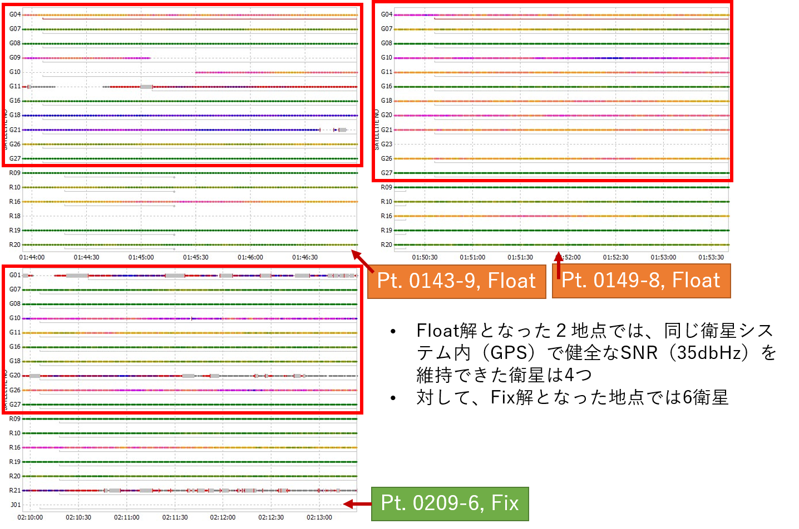

# L1-DGNSS accuracy verification - by comparison with known points
**Conclusion: the shorter the baseline length and the lower the noise, the better**.

## Location

- Large landslides seen from an airplane in the Tohoku region
  - Maximum difference in elevation between measurement points 202.4 m, maximum baseline 1.4 km
- Base: 1 point (coordinates unknown)
- Rover: 14 points (coordinates known)
- Rover specification: EMLID Reach RS
  - Instrument nominal accuracy: 5.0 mm horizontal + 1 ppm × D, 7.0 mm vertical + 1 ppm × D
  - Maximum value of D = 1,400 m, **horizontal 6.4 mm**, **vertical 8.4 mm**
  - Antenna height 2.0865 m, 60-minute bubble tube  
      - When the air bubble contacts the marker circle, the antenna position is displaced by 36.42 mm in the horizontal direction.
      - Actually it is set up for the center of the marking circle.
- Known Coordinates: GNSS 1st class surveyor single frequency static method
  - Nominal accuracy of the device: 3.0 mm horizontal + 0.5 ppm x D, 5.0 mm vertical + 0.5 ppm x D
  - Maximum D = 1,880 m, ** 3.94 mm**, ** 3.94 mm flat, ** 5.94 mm vertical**

## Method

- Rover measurement time: 3 minutes
- How to install Rover
  - Place the monopole props in the center of the recess or nail in the center of the pile head at the known point.
- RTKPOST processing
  1. Base coordinate is calculated backward from the known coordinate of the nearest neighbor.
  2. find the coordinates of the remaining 13 points with RTKPOST
- Two types of accuracy verification
  1. Comparison of the coordinates of 13 points with the coordinates of known points (Last of 999.9)
  2. a comparison of Last of 999.9 and Ave of 999.9

## Result 1: Comparison with known points
- the nearest known points from the Base (1 point)
- Use it for inverse calculation of absolute coordinates of the Base

- The remaining 13 known points.
  - Fix 11 points
  - Float 2 points
  - Known point coordinate error 1 point (excluded)

- One of the Fix points (0113-11) has a maximum ratio of 471.4  
  - The coordinate value for this point is an epoch of ratio 471.4
  - for Ave, average is calculated using epochs with a ratio of more than 100
  

## Result 2: Two locations with a Float solution

## Result 3: Compare Last and Ave to Known Points.

## Discussion 1: L1-DGNSS Accuracy assessment

- **It is a simple survey method that provides the best accuracy at this time**.
  - For short baselines (1.4 km in this case), you can get a good accuracy with the Fix solution.
    - Horizontal (D2d): Ave 1.70 cm, SD 1.11
    - Three-dimensional (D3d): Ave 3.24 cm, SD 2.09
  - Three dimensional accuracy (U-D accuracy) has the potential to be better.
    - The exact height reference plane of the pile head at the base point measurement was unknown (professionals use a tripod). It was hammered with high nails, carved crosses, tilted, and in various states of disrepair.
- What does accuracy assessment verify: Error = Observation Error + Instrument Installation Error + Known Point Error**
  - As far as horizontal accuracy is concerned, the error in instrumentation by the observer is small (self-aggrandizement).
  - Although it is difficult to separate the accuracy of PPK-L1GNSS itself from other factors (instrument installation error and known point error), instrument installation error may be a major contributor to the overall error.
- **Indicators for obtaining a Fix solution: GDOP and SNR**
  - The GDOP of the Float solution point is not as bad as the Fix solution point. However, the overall SNR is low; the reason for the low SNR could be due to shading by vegetative foliage

## Discussion 2: Last vs. Ave

- **Everything is pretty much the same regardless of which one you use; Last of 999.9 would be fine**.
  - The difference between the Last and Ave coordinates
    - Horizontal (D2d): average 1.7 mm, SD 1.4
    - Three-dimensional (D3d): average 3.4 mm, SD 2.7
  - Comparison with known points
    - Horizontal mean 1.70 cm, SD 1.11, three-dimensional mean 3.24 cm, SD 2.09
    - Horizontal mean 1.76 cm, SD 1.14, three-dimensional mean 3.18 cm, SD 2.15
- Advantages and disadvantages  
When using Last of 999.9:  
　pros) The acquisition of coordinates is completed by copying and pasting one line. Easy to work with.  
　cons) Troubles when there are multiple 999.9 peaks or a large tendency for the position to change  
If you use Ave of 999.9:  
　pros) Even if the change in position is large, a value close to the overall trend can be obtained (probably).  
　cons) The work is tedious (shaping of pos, extraction of 999.9, and averaging of coordinate values)

## Reach RS / Reach RTK

- **Reach RS has the advantage of higher antenna gain**.
- Reach RS: Antenna TW2706, LNA Gain 28 db typ.
- Reach RTK: Antenna TW4721, LNA Gain 26 db min.  
　A (wildly) simple calculation shows that RS's antenna has a 1.26 times greater gain.

## Recommended articles and references cited

- Recommended articles
  - 測位衛星技術株式会社 (2016) [GNSSの基本知識 Version 1.0.](
https://gnss.co.jp/wp-content/uploads/2016/07/ddd790b4eae745d43594c4f302b14761.pdf)  
  - Takasu, T. (2013) [RTKLIB: Documents.](
http://www.rtklib.com/rtklib_document.htm)
  - [rtklibexplorer (2018) Brog.](
https://rtklibexplorer.wordpress.com/)

- References cited
  - 中島伸一郎・古山陽太・林佑一郎・Nguyen TRUNG KIEN・清水 則一・廣川誠一 (2018) 急傾斜長大斜面のGPS三次元変位計測における誤差補正の効果と長期連続モニタリング結果. 日本地すべり学会誌, Vol. 55, No.1, pp.13-24.
  - 内山庄一郎・齋藤仁 (2018)[センチメートル級の地形変化抽出を目指した地上基準点のGNSS観測（速報）](https://drive.google.com/file/d/1lU5Ps7krNI9C8k60ENFrOaDnGGLRdAPD/view).第9回GIS-Landslide研究集会および第5回高解像度地形情報シンポジウム発表要旨集, pp.28-30.
  - 内山庄一郎 (2018) 必携ドローン活用ガイド. 東京法令出版.
