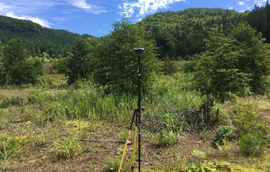

# processing using RTKLIB

This document is created from the JGU Summer School 2018 in Hokkaido, "Further Evolution of UAS (Drone)-based Topographic Measurement ' (July 29, 2018) [Handout] (. /RTKLIB_uchiyama_20180729v3s.pdf) (Authored by Shoichiro Uchiyama) (National Research Institute for Earth Science and Disaster Prevention) (c) HD-Topography Project CC-BY 4.0). All rights to the figures and tables shown below are reserved by the quotation source.

## index 

---

### 1. [planning](./1.plan/1.plan.md)
### 2. [measurement](./2.measurement/2.measurement.md)
### 3. [post processing](./3.analysis/3.analysis.md)
### 4. [accuracy assessment](./4.accuracy/4.accuracy.md)

---

If you have any questions about this page, please contact the administrator.

---

[back to Top](https://github.com/hdtopography/learning)
