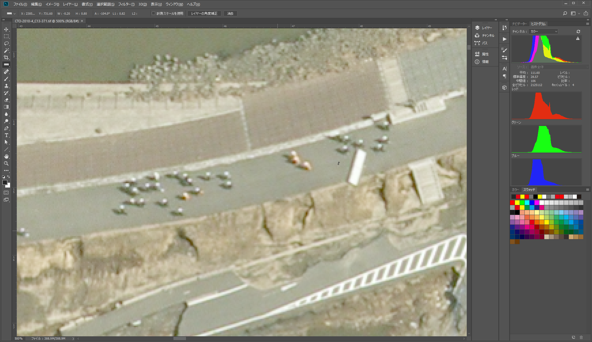

# 参考1：UAV-SfMによる地図作成技術の概要
---
　UAVとSfMを用いた地図作成の一般的な流れは次のようになる。  
1）撮影領域を定め、  
2）対空標識の設置と計測を行い、  
3）飛行計画を立てて  
4）写真撮影フライトを行い、  
5）撮影写真と対空標識の位置座標を計算ソースとしてSfM解析を行う。  
6）成果物としてオルソモザイク画像およびDSM（Digital surface model; 地表面数値標高モデル）を出力する。  

　高精度な成果を得るためには、考慮すべき点が多く、作業全体の計画の緻密さが成否を分けるといっても過言ではない。以下に、基本的な留意点を述べる。  

## 対空標識：10地点以上、検証点も同数程度  
---
-	撮影領域の内側かつ、複数枚の写真に写りこむように設置する。
-	高精度なGNSS等で位置座標を計測する。
-	水平分布のみならず垂直（標高）方向も広くカバーするように配置する。
-	二時期のDSMの変化抽出を行う場合は、対空標識の設置場所と計測精度が不適切であると、意味のある結果は得られない。  

### 飛行計画
---
1. UAV搭載の写真機材の性能（センサーサイズ、画素数、焦点距離、FOV）を把握する
2. 作業目的に適う地上分解能（GSD）が得られる対地高度を求める
3. 飛行する対地高度が決まれば一枚の撮影範囲が決まる
4. 撮影機材における画像記録スピードを実験で求める
5. 画像記録スピードを超えないよう、UAVの進行方向において隣接する写真間の重複率が80%以上になる飛行スピードを決定する
6. 加えて、飛行コース間の写真の重複率も80%以上となるように飛行コースを計画する
7. 飛行コースと飛行スピードから推定される総飛行時間を求める
8. 総飛行時間を、使用する機材の実質的な飛行可能時間で割ることにより、概略の全飛行回数が求まる。  

　上記に加えて、航空法、機材の運用限界、安全確保のための体制、運航者および運航に関わる者の技能・知識、気象条件（風、気温、雲量、太陽高度・方位、日射、積雪、湿度）および地形（平地、山地、起伏）を考慮した計画立案が必要となる。  

FOV: Field of View　画角（写真の対角線方向の角度）  
GSD: Ground sample distance　地上分解能（一画素あたりの地表面の実寸サイズ）  

 
# 参考2：ビルトインレンズプロファイル（BiLP）の悪影響
---
  
Fig. 12.1 RAWデータにBiLP情報が含まれる旨のメッセージ。このカメラでJpegを保存すると、無条件にBiLPが適用される。オフにすることができない。このソフトウェア（Adobe Camera Raw）では、BiLPを無効にした現像ができない。Raw Therapeeなどの別のソフトウェアで現像を行う必要がある。  

  
Fig.12.2 BiLP無しの写真で作成した地形モデルと、BiLPが適用されたJpeg写真で作成した地形モデルの垂直方向の差。▲は地上基準点、■は撮影位置。  
　地上基準点からの距離が離れるほど、垂直方向の差が大きくなることが読み取れる。  

  
Fig.12.3 SfMソフトウェアで、RAW画像（dng形式）を直接読み込んで作成した地形モデルと、Raw Therapee（現像ソフトウェア）でBiLPを削除してTiff化した写真で作成した地形モデルの垂直成分の差。▲は地上基準点、■は撮影位置。  
全域で、ほとんど差がない（黄色）ことが読み取れる。若干の差があるのは、斜面上に垂直に設置された雪崩防止柵や家屋の壁の水平位置のわずかな誤差によって生じるもの。  

  
Fig.12.4 図中の黒線の断面図（下から上へ）
オレンジ色が、BiLP無しとBiLP適用Jpegで作成したモデル間の垂直成分の差（Fig.12.2）
青色が、BiLP無しの写真で作成した地形モデル同士の垂直成分の差（Fig.12.3）  
破線は近似直線。   

# 参考3：適切なGSD（地上分解能）の決定
---
## ４つの物体認識レベル：ジョンソン基準（Jhonson, 1958）
　1 検知（Detection）、2 向きが分かる（Orientation）、3 認識（Recognition）、4 識別（Identification）。この基準は、現在のカメラやセンサーの「視力」を評価する際にも参考にされる。

  
　この表は、物体を認識するために必要な空間周波数（ラインペア）を様々なターゲットに対して実験を行った結果をまとめたものである。着目すべきは最下段のAverageで、各認識レベルに必要な空間周波数（ラインペア）は一定の値に収まる、という点である。空間周波数（ラインペア）の値を2倍すると画素数と読み替えることができる。　　

 以上をまとめると、物体の認識に必要な画素数は以下のようになる。  

|1 検知（Detection）|2画素±0.5画素|
|:---|:---|
|**2 向きが分かる（Orientation）**|**2.8画素±0.7画素**|
|**3 認識（Recognition）**|**8.0画素±1.6画素**|
|**4 識別（Identification）**|**12.8画素±3.0画素**|
なおこの値は、物体とその背景とのコントラスト差が十分にあることを前提としている。

　例えば、GSD（地上分解能）が16.5cmの空中写真を使用した場合、上から見た人間（75cm×30cm）は4.5画素×1.8画素で描画される。この画素数は、「検知」と「認識」の中間となる。人間の立っている背景とのコントラストが明瞭な場合や、周囲の状況もふくめて判断するならば、そこに人間が存在していることをぎりぎり認識できる可能性がある、といえる（Fig.13.1）。  

  
Fig.13.1 GSDが16.5cmの空中写真で人間を上から見た例
「認識」レベルには少し画素が足りないが、この例では、道路上で、同じ程度の長さで影があり、服の色が異なるが頭部は白いヘルメットであることから、人間と認識できる。

  
Fig.13.2 GSDが16.5cmの空中写真で車輛（乗用車、トラック）を上から見た例  
同じ空中写真で車輛（2.0m×5.0ｍ：12.1画素×30.3画素）を見た場合は、「識別」に必要な画素数を大きく超えるため、容易に「識別」できる。  

  
Fig.13.3 UAV搭載カメラで撮影した写真の例
この写真は、GSD 3.3cmの地上分解能で撮影した積雪表面の様子である。ここに、オレンジ色で緑のキャップの350ccのペットボトルが「認識」できる。分かるだろうか。  

以上の知見を活用すると、地形モデルを作成する際のGSDの決定において参考になる。  
何のために、どのサイズの物体を、どの認識レベルで撮影したいのであろうか。  
その物体は、その物体が存在する周囲とのコントラストの差はどの程度あるだろうか。コントラストが大きければ、より少ない画素で目的の認識レベルを実現できる。その逆もしかり。そのように考えると、おのずと必要なGSDが求まる。  

### 参考文献：
John Johnson (1958) Analysis of image forming systems., in Image Intensifier Symposium, AD 220160 (Warfare Electrical Engineering Department, U.S. Army Research and Development Laboratories, Ft. Belvoir, Va., 1958), pp. 244–273.  
 
# 参考4：GCP（Ground control point: 地上基準点）の設置
---
　GCPは、マーカー（Markers）ツールを使用して、写真上の場所を指定する。マーカーは、GCPの設置のほか、写真配置の最適化、座標系の設定、シーン内の距離とボリュームの測定、そしてマーカベースのチャンクアラインメントにも使用される。どの用途で使用しても、設置の手順やマーカーアイコンの見た目は変わらない。ソフトウェアの挙動をよく理解する必要がある。ここでは、GCPとしてマーカーを設置する方法を説明する。  
　なお、写真の品質や解析処理のフィージビリティーを評価する目的でWorkflowの各解析処理を試験的に実施する場合、GCPの設置は必須ではない。ただし、カメラの座標が与えられていない状態で解析を実施すると、モデルの天地や方位が正しく表示されない。  
  

## GCPの設置
---
　GCPは、写真上にマーカーを配置し、配置したマーカーに位置座標の数値を与えることによって行う。マーカーの配置方法には、手動マーカー配置とガイド付きマーカー配置の2つの方法がある。設置の際の挙動や実施条件が異なる点に注意すること。  
1. 手動アプローチは、GCPが見えている複数の写真に対し、マーカーを手動で配置する方法である。手動によるマーカーの配置は3Dモデルを必要としない。つまり、Align photosの前でも実行できる。
2. ガイド付きアプローチを行うには、Build dense cloudで作成した3Dモデルが必要となる。GCPが写っている一枚の写真にマーカーを配置すると、3Dモデル上のGCPに対応する場所に自動的に投影し、マーカーが見えている残りの写真についても、自動でマーカーを配置する。その後、個々の写真に自動的に配置されたマーカーを、精度を向上させる目的で、より正しい位置に手動で配置し直すこともできる。ガイド付きアプローチは、マーカーの配置作業を大幅に高速化し、誤った位置にマーカーを配置する可能性を低減する。特別な理由がない限り、この方法が推奨される。 

# 参考5：カメラアライメントの最適化：Optimize cameras
---
　Align photosの処理過程で、写真の内部・外部標定要素を推定する。この推定は、画像データのみを使用して実行され、誤差を含む。誤差の要因は、隣接する写真間の重なり量やオブジェクト表面の形状など、多くの要因に依存する。海や水面が広い面積を占める場合は、推定結果を悪化させる原因となるため、当該領域にMask処理を行う必要がある。  
　モデル座標を地理座標系に変換する際、モデルは7パラメータ変換（変換のための3つのパラメータ、回転のための3つのパラメータ、スケーリングのための1つのパラメータ）を使用して線形変換される。この変換では線形誤差のみを打ち消すことができるが、非線形成分を除去することはできない。  
　モデルの非線形変形を行うには、既知の基準座標に対し、ジオリファレンスされた座標およびカメラパラメータ（内部標定要素）を使用してOptimize camerasを実行する必要がある。Optimize   camerasによる最適化中に、再投影誤差と基準座標ずれ誤差の合計を最小にするように、ジオリファレンスされた座標とカメラパラメータを調整する。  
　より優れた最適化結果を得るために、あらかじめSparse point cloud上の誤差の大きい点を削除することが望ましい。Gradual selectionを使用してフィルタリングし、誤差の大きい点を削除する。  
　Optimizeにより、ジオリファレンス精度を大幅に改善することができる。モデルを測定用途に使用する場合は、最適化を実行する必要がある。  

## Optimize camerasの注意事項
---
　接線歪みパラメータp3、p4は、p1、p2の値がAlign photos後に値が推定されていた場合のみ、最適化に使用できる。  
　Dense point cloudおよびMeshが存在する場合は、Optimize cameras実行後にクリア（消去）される。Optimize cameras後に再構築する必要がある。  

## Optimize camerasを実施するタイミング
---
　GCP設置後、カメラの位置情報を使用せず（Uncheck）、GCPの位置座標を使用してOptimize camerasを実行するのがベストなタイミングとなる。この理由は、一般的に、カメラ位置のGNSSデータと比較して、GCPの座標は高い精度で測定されるためである。さらに、GCPとカメラの座標は、異なる座標系で測定されることが多く、カメラとGCPの両方のデータを同時に最適化することができない。GCPを使用することで、より正確な最適化結果を得られる。最適化の結果は、ReferenceペインのError項目から評価できる。  

# 参考6：Sparse point cloudのフィルタリング
---
　Sparse point cloud中に大きな再投影誤差を持つ点がどこにあるかを知ることや、高いノイズ量を表す点を除去することは有用である。この作業のため、Gradual selectionツールから、Sparse point cloudをフィルタリングする各ツールが利用できる。フィルタリング手法（Criterion）には以下の方法がある。  

  
## Reprojection error
---
　大きな再投影誤差は、ポイントマッチング処理において、対応する特徴点の投影精度が低いことを示す。誤ったマッチングが行われた場合も同様である。これは、水面やテクスチャーの弱い建物の屋根などの人工物で多く見られる。このようなポイントを削除すると、後続のOptimize camerasによるモデルの最適化処理の精度が向上する。推奨値は0.5から1.0程度。Reconstruction uncertaintyと合わせて使用し、削除するポイント数は、Sparse point cloudの全ポイント数の5%程度を目安とし、10%を超えないようにする。削除しすぎるとDense point cloudを生成できなくなる。  
## Reconstruction uncertainty
---
　写真と写真の距離（ベースライン）が近すぎる、つまりオーバーラップ率が高すぎる写真からReconstructされた点群は、不確定性が高くなる。これは、無人航空機の離着陸における垂直上昇/下降中に連続で撮影した写真や、上空でホバリング中にインターバルタイマーで連続撮影を行なった場合などに発生する。このような点は、モデルの表面から顕著に逸脱し、点群中のノイズとなる。このようなポイントを削除しても最適化（Optimize cameras）の精度に影響はないが、Dense point cloudを作成する前に削除すると、点群の視覚的外観や、DSMの異常値を改善する。ベースラインが近すぎる写真をあらかじめ削除することも効果的である。推奨値は、20から100程度。Reprojection errorと合わせて、元のSparse point cloudのポイント数に応じて、削除しすぎないように注意する。  
## Image count
---
　最小で2枚の写真に写っているすべての画素について点群が計算される。しかし、2枚の写真にしか写っていない画素は、正確さが劣る。Image countフィルタにより、そのような信頼できない点を取り除くことができる。  
## Projection Accuracy
---
このフィルタは、特徴点が抽出された領域が大きいために局所性が低い点を除外する。 

# 事例1：アナログ空中写真とUAV写真による二時期のDSMの比較
---
  
1978年・2015年のDSMから2006年と2007年の台風によって破壊され倒壊したと考えられるマングローブ林の範囲を抽出。1978年からの37年間で、マングローブ林の成長および、樹冠が低下している領域の存在を示唆。  
Shoichiro UCHIYAMA1 and Toyohiko MIYAGI (2016) Acquisition and utilization of high-definition digital surface models through aerial photography using a small unmanned aerial system: an example of typhoon damage in Iriomote Island mangrove forests, Japanese Geomorphological Union, 37-1, p. 159-173. 

# 事例2：デジタル空中写真とUAV写真による二時期のDSMの比較
---
  
2014年広島市の土石流災害における捜索支援地図の作成  
無人航空機撮影写真：対地高度150m、約5,500枚（解析は約770枚使用）  
空中写真：2008年撮影空中写真（DMC）25枚  
地上基準点測量の実施：GNSS (VRS)、30点  
住宅地図（株式会社ゼンリン）  

# 事例3：LIDARとUAV写真による二時期の比較
---
  
2017年栃木県那須町の雪崩調査：積雪深の推定
観測範囲は東西900m，南北550m，標高差は320ｍ
対地高度は150m，撮影写真の地上解像度は約3.3cm/px  
垂直誤差：地上基準点と検証点の計18点の平均値が0.41cm，最大値9.5cm，最小値-7.7cm，標準偏差は4.46  
