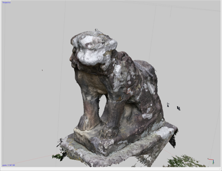
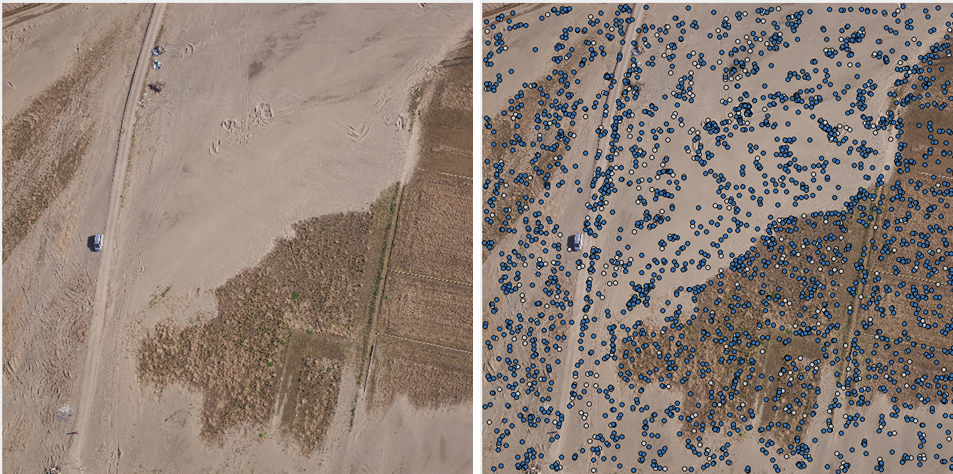
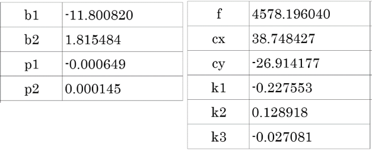
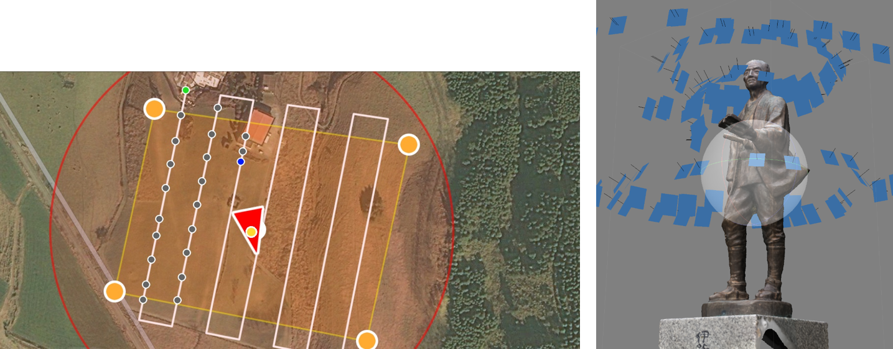
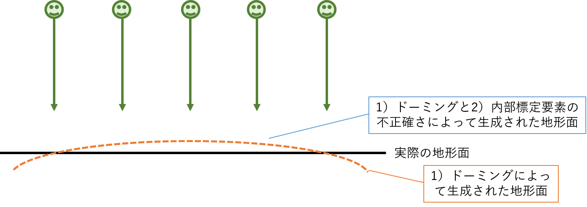

# 1.SfM写真測量の基礎
SfM多視点ステレオ写真測量  
SfMは高度な推定技術：**内部標定要素**・**外部標定要素**  

---

## SfM-MVS Photogrammetry: SfM多視点ステレオ写真測量

### ・Structure from Motion (SfM)
- 撮影位置と姿勢：**外部標定要素** の推定
- レンズ歪み：**内部標定要素** の推定
- 画像特徴点の三次元分布を推定（図1）：写真測量

図1：Strcture from Motionで推定した画像特徴点の三次元分布

## Multi-view Stereo (MVS)
- SfMで推定した画像特徴点と複数のステレオペア画像から高密度点群モデルを構築（図2）

図2：Multi-view Stereoで生成した高密度点群モデル

## 特徴
- 伝統的な「写真測量」がベースの技術
- コンピュータビジョン研究で発展、処理自動化
- ノンメトリックカメラを使用した「写真測量」が可能
- レーザー測量に比して、初期プロダクト生成までの時間が短い（迅速性）
- 写真測量の精度を求めなければ、伝統的な写真測量に比して習得・操作が容易
- 精度を必要とする計測の場合、難易度は高い
- **外部標定要素の精度の低さ、ノンメトリックカメラを要因とする各種誤差**
- **これらの理解と把握、適切な対策が要求される**

## SfM解析フロー：① SfM処理
### 画像特徴点の抽出、タイポイントの決定

グレーの●が画像特徴点  
青い●が画像特徴点のうち、タイポイントとて扱われている点

### 外部標定要素（撮影位置と姿勢）、内部標定要素（レンズ歪みパラメータ）の推定

青い四角が撮影位置, 黒い棒の向きが撮影姿勢

SfM解析フロー：② 地上基準点（GCP）の設置

## SfM解析フロー：② 地上基準点（GCP）の設置
### 外部標定要素・内部標定要素の**推定精度向上**、三次元モデルの**ジオリファレンス**

## SfM解析フロー：② 精度検証点（CP）の設置
### 三次元モデルの精度検証に使用する地点。**GCPを使用した精度検証は避ける** こと

## SfM解析フロー：③ 高密度点群の計算 (MVS)
### 全写真の全画素（または1/2, 1/16, 1/64, 1/256）に対する位置座標の計算

## SfM解析フロー：③ 高密度点群の拡大表示
### 写真の画素数を1/16 (Medium) に間引いて計算した例

## SfM解析フロー：④ DSMの作成と出力
### 地表面標高モデル (DSM: Digital Surface model)

## SfM解析フロー：⑤ オルソモザイク画像の作成と出力
### オルソモザイク画像（オルソ画像）＝正射投影画像、地図と重なる画像、写真地図

## SfM解析と精度検証
### SfM解析＝三次元地形モデルの作成
- 精度を劣化・不安定化させる要因
    - 内部標定要素の推定（レンズ歪み、約10パラメータ）
    
    - 外部標定要素の推定（撮影位置のX,Y,Z座標、カメラの向き3軸）
    - →対策：既知の高精度な内部標定要素パラメータの使用
    - →対策：高精度に計測・設置された地上基準点の使用（●）
- DSMの三次元精度検証（○）  
  例）三次元RMSE: 3.08 cm

    

※参考文献：内山庄一郎・ほか (2018) 雪崩災害調査へのUAV-SFMの適用: 2017年那須町雪崩災害の事例.自然災害科学, 37, 特別号, pp.119-135.

## 地上基準点の高精度化
1. 空から明瞭に見えるターゲットの使用  
    - 大きく、明るすぎず、周囲とのコントラストが高い
2. 設置地点数を可能な限り増やす  
    - 理想は20地点（GCP/CP各10地点）以上  
    - 解析時に使えない点も生じること
3. 品質の良い写真の撮影
    - ブレたり、写っていなかったり、読み取れなかったりしたら、すべての努力は水の泡
4. 測量精度の向上
    - 光波測距儀（1 mm）、搬送波測位GNSS（1 cm）
    - 内山 (2018) [RTKLIBによる解析](https://github.com/hdtopography/learning/tree/master/GNSS#rtklib%E3%81%AB%E3%82%88%E3%82%8B%E8%A7%A3%E6%9E%90), JGU夏の学校2018 in 北海道.
5. ±0.1 画素の精度で配置（SfMソフトウェア）
    - すべて手動で配置する（ 「自動配置」で作業をやめない）

## 撮影設定
- 条件：内部標定要素（f, cx, cy, k...）が変化しないこと
  - **絞り（f値）固定**
  - **フォーカス固定**（マニュアルフォーカス）
  - **手ぶれ補正機構は使用しない**
  - RAW形式
  - ホワイトバランスは自由（RAWで撮影する場合）
  - ISOはできるだけ低く（分解能低下、ノイズ増加）
- グラウンドスミアが生じないシャッタースピード
  - 大画素、低空飛行時は配慮が必

## 撮影の方法：基本
- カメラの位置を移動させながら撮影する
  - Structure from Motion
- 撮影範囲のオーバーラップ（重複）は80 %
  1. UAVなら垂直直下写真（空中写真）
  2. 物体なら平行移動や螺旋移動

  

## 撮影の方法：課題
### 垂直直下写真のみでSfM解析を行うと、特定の問題が生じる

  

1. **ドーミング**（程度の多少はあれ、必ず生じる）  
写真セットを垂直直下写真のみで構成すると生じる
2. **段差状の地形面**  
内部標定要素の推定精度が低いと生じる

歪みの大きさ
- 数センチメートルから、時に数メートルに達する
- 二時期の差分（地形変化の計測等）を計算した時に顕著に可視化される

## 撮影の方法：ドーミング対策
### **斜め写真を追加** する（オフナディア角は20度程度）

  

## 参考：SfM多視点ステレオ写真測量と地上レーザー測量の違い

