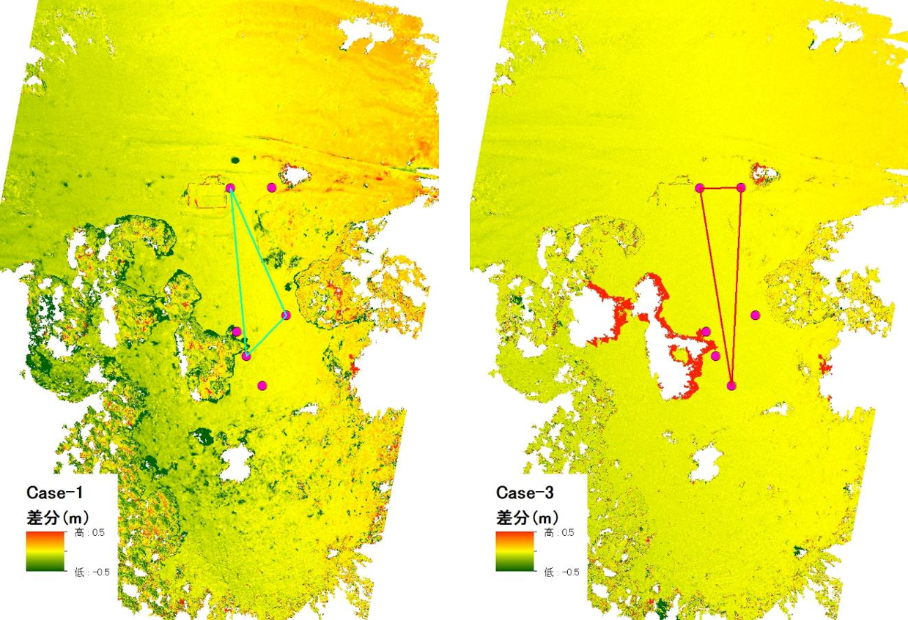
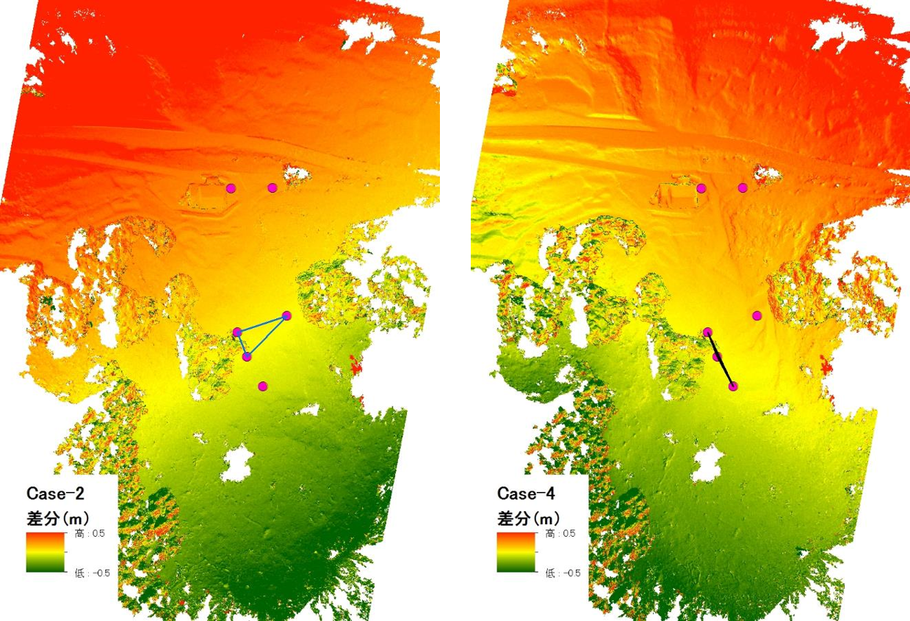

# ３.SfM計測事例
**既存地形データとの分解能の差異**  
**GCPの配置と精度への影響**

---

## 2013年11月伊豆大島の斜面崩壊地形

計測目的：既存の数値地形データとUAV-SfM地形データの定性的な違いの検討  
撮影日：平成25（2013）年11月14日  
対象地：伊豆大島の斜面崩壊地形  
対象範囲：約12 ha  
使用カメラと撮影方法：
  - Ricoh GR (APS-C 16 Mpx CMOSセンサ、焦点距離18.3 mm)
  - UAVにより対地高度50 mから合計578枚の垂直写真を撮影   

結果：
  1. DSM: 分解能 0.09 m
  2. オルソモザイク画像：分解能 0.02 m

[※参考文献：内山庄一郎, 井上公, 鈴木比奈子 (2014) SfMを用いた3次元モデルの生成と災害調査への活用可能性に関する研究. 防災科学技術研究所報告. 81, 37-60.](https://dil-opac.bosai.go.jp/publication/nied_report/PDF/81/81-4uchiyama.pdf)

既存地形データとUAV-SfM地形データの定性的な差異  
UAV-SfMデータの特性  
1. 高分解能
  - 既存の詳細な地形データ（5 m DEM）より高分解能
  - UAV-SfMにより得られる成果はDSM（地表面数値モデル）であり、DTM（Digital Terrain model: 地形モデル）ではない
2. 低コスト・高機動
  - 地上/航空レーザー測量に比して低コスト
  - 持ち運びが可能な機材の場合、機動性も高い  
  →精度は未検証
    - この事例では精度を検証していない
    - 高分解能＝高精度ではない

## 2014年4月福島県西会津の斜面災害跡地

目的：UAV-SfMの簡易的な精度検証  
撮影日：平成26（2014）年4月17日  
対象地：
  - 福島県（西会津方面）の斜面災害跡地（斜面長100 m×斜面幅30 m）  
  - 撮影範囲：約200 m×約100 m  
使用カメラと撮影方法：外部標定要素は無し  
  - Ricoh GR (APS-C 16 Mpx CMOSセンサ、焦点距離18.3 mm)  
  - 対地高度50 mと100 mから合計426枚の垂直写真を撮影

地上基準点と精度検証点：トータルステーション (TS)で地上基準点と精度検証点の位置座標を測量  
成果：
  1. DSM: 分解能 0.02 m
  2. オルソモザイク画像：分解能 0.01 m

※参考文献：内山庄一郎・山村充・井上公・熊井直也 (2014) 小型UAVとSfMによる斜面変動地形の三次元モニタリング, 第53回日本地すべり学会研究発表会講演集, pp.40-41.

## GCP設置地点に対するDSM精度の変化

目的：
- 精度を下げるGCP配置の特徴
- 3地点のGCPで得られるDSMの精度
- 撮影範囲に立ち入れない場合の対応  

基準データ：
- **外部標定要素なし** の写真を使用
- 6地点のGCPを使用して出力したDSM  

包囲面積（GCPが囲む面積）：1,798.8 m2
（対象範囲の9.0 %）

GCP設置パターンと包囲面積  
  - Case 1: 842.1 m2（4.2 %）
  - Case 2: 157.2 m2（0.8 %）
  - Case 3: 942.6 m2（4.7 %）
  - Case 4: 11.4 m2（0.06 %）

## 検証2：基準DSMとの差分：Case-1, 3
Case-1（左）：地形面全体が西下がり（東上がり）に傾いている  
Case-3（右）：基準DSMとほぼ同じ精度

## 検証2：基準DSMとの差分：Case-2, 4

いずれのケースでも、地形面全体が大きく傾いている  
Case-2（左）では北西側が高く、Case-4（右）では北東側が高い

## 2014年4月福島県西会津の斜面災害跡地
結論：
  - 地上基準点（GCP）の配置は、DSMの精度に影響を与える
  - 精度を劣化させるGCP配置
    - NG例）**局地的な配置**（GCPが囲む面積が小さい）
    - NG例）線状の配置、配置GCP数が少ない
    - 外部標定要素がない場合、精度はGCPの影響を特に受ける

UAV-SfMのメリット：  
  - 計測作業が比較的簡易であり、全体として低コスト化できる
  - 局地的ながら迅速かつ容易に高分解能な地形情報が得られる
  - 地図情報レベル250クラスの図面を作成できるポテンシャルがある  

課題：
  - 高い計測精度を求める場合、適切なGCPの配置と高精度な測量が必要
