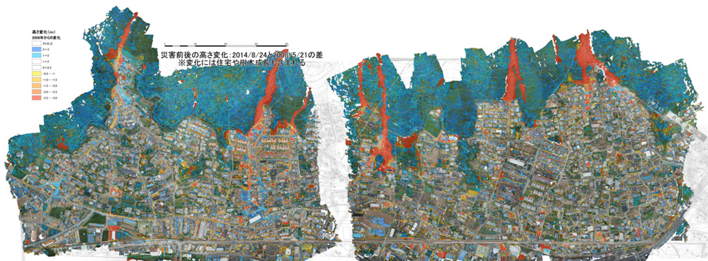
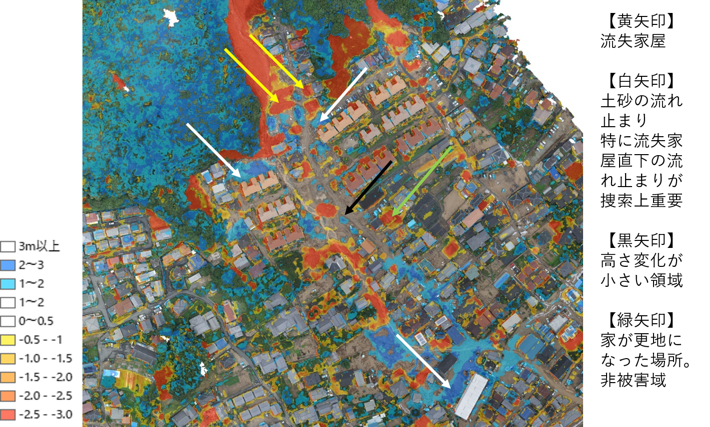

# ５.SfMとUAVの活用

---

## 災害対応事例：平成26年8月広島土石流災害

目的：要救助者の捜索を支援する地図情報の提供
  - 縮尺1:1,500に印刷した大判地図を提供
  - A3サイズに分割した地図のPDFデータも提供

活動期間：2014年8月24日に撮影・解析、翌25日の午後3時に地図提供

実施内容：**捜索支援地図** の作成  
  - 実際の自然災害での無人航空機の飛行と写真撮影
  - 災害初期対応期間での地図成果の提供
  - 災害前のデジタル空中写真の活用
  - 流失家屋、土砂堆積範囲および堆積厚さの可視化
  - 住宅地図のオーバーレイ

結果：実際の捜索救助活動で活用され、要救助者位置推定に有用として評価を得た

※参考文献：[内山庄一郎・ほか (2014) 平成26年8月豪雨による広島土石流災害における空撮写真を用いた捜索支援地図の作成, CSIS DAYS 2014, p.16.](http://www.csis.u-tokyo.ac.jp/csisdays2014/csisdays2014-ra-pdf/A10.pdf)

捜索支援地図：災害後オルソ画像、高さ変化、住宅地図の重ね合わせ  
要救助者の位置推定：流失家屋、被災家屋、堆積土砂厚さ、土砂流れ止まり  
捜索効率低下の予防：高さ変化が小さい場所（元の地表面以下への掘削防止）  

災害後オルソ画像と住宅地図（家屋形状、表札情報）の重ね合わせイメージ
実際には、表札情報（居住者名）が入った地図を使用

## 平成26年8月広島土石流災害

1. **捜索支援地図** の作成と提供
  - 災害状況の可視化により、要救助者の位置推定を合理化
  - 現地実動機関に実際に活用された
  - 「災害状況把握のスピードが飛躍的に向上し、捜索上の課題を解決する先進的な情報取得技術」（村上・松上、2016）
2. 災害前後の地表面高さ変化の可視化
  - **高精度な計測技術** としての **UAV-SfMの応用**
  1. 変化抽出：災害前のDSM（比較基準データ）が必要
    - 既存の航空レーザー測量DSM
    - 既存の空中写真のSfM処理
  2. 高精度化：地上基準点の取得が必要
    - 被災領域に立ち入れない場合の対応策
      - ベースラインDSMから災害前後の共通位置の座標を読み取る
      - 内部標定要素の高精度化：事前の高精度キャリブレーション
      - 外部標定要素の高精度化：撮影位置 (GNSS), 撮影姿勢 (IMU)

※参考文献：村上圭・松上倫也 (2016) 土砂災害時における災害対応の標準化, 都市政策, 第164号, pp.63-68.

## まとめ

SfM多視点ステレオ写真測量
  1. オルソ画像の作成ツール
    - 既存手法と比較すると驚異的に簡単
  2. 高精度な計測技術
    - <u>推定要素を高精度化</u>するための技術理解と努力と工夫が必要
    - 内部標定要素：レンズの歪み
    - 外部標定要素：撮影位置・撮影姿勢
  3. 事例：UAV-SfMによる災害対応の高度化
    - 迅速：例）400 m四方の<u>オルソ画像の完成まで2分</u>
    - 超高分解能：地上で活動する<u>個人まで識別</u>できる分解能
    - 変化抽出：災害前後や災害経過の二時期から<u>地表変化の把握</u>

## 参考文献（本文中以外）：
- [内山庄一郎，2018，必携ドローン活用ガイド，東京法令出版．](https://www.tokyo-horei.co.jp/shop/goods/index.php?13178)
- 内山庄一郎，2014，地すべりキーワード101「8　地理情報システム」，日本地すべり学会誌，第50号，pp.32-33．
- 内山庄一郎，2016，地すべりキーワード101(21)無人航空機：安全運航編，日本地すべり学会誌，Vol.53, No.6，pp.25-27．
- [内山庄一郎，2015，自然災害研究における三次元形状取得のためのSfM-MVS技術の活用，東京大学空間情報科学研究センターディスカッションペーパー「高解像度地形情報シンポジウム論文集～地形情報のすべて～」，137，pp.20-23．](http://www.csis.u-tokyo.ac.jp/dp/137.pdf)
