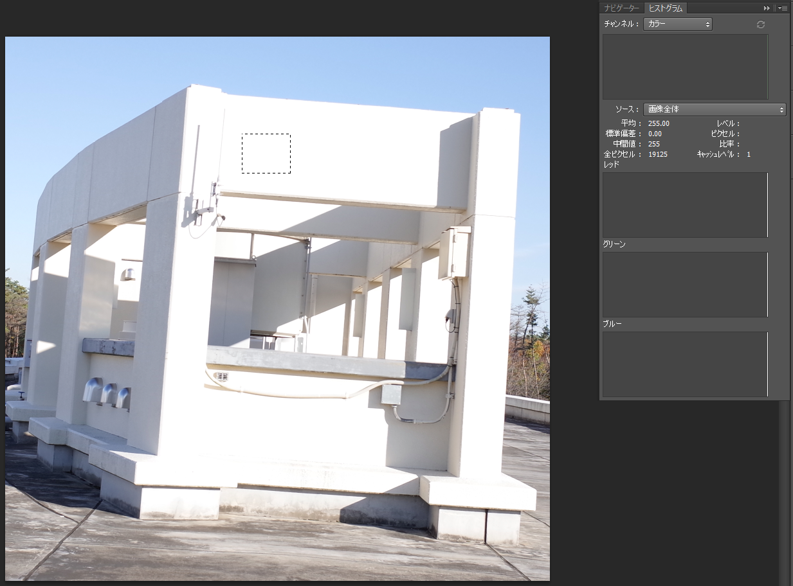
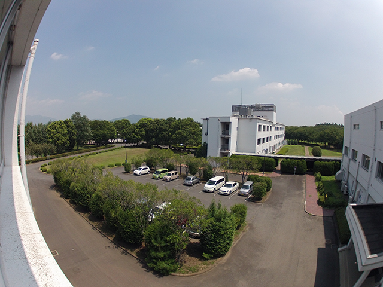
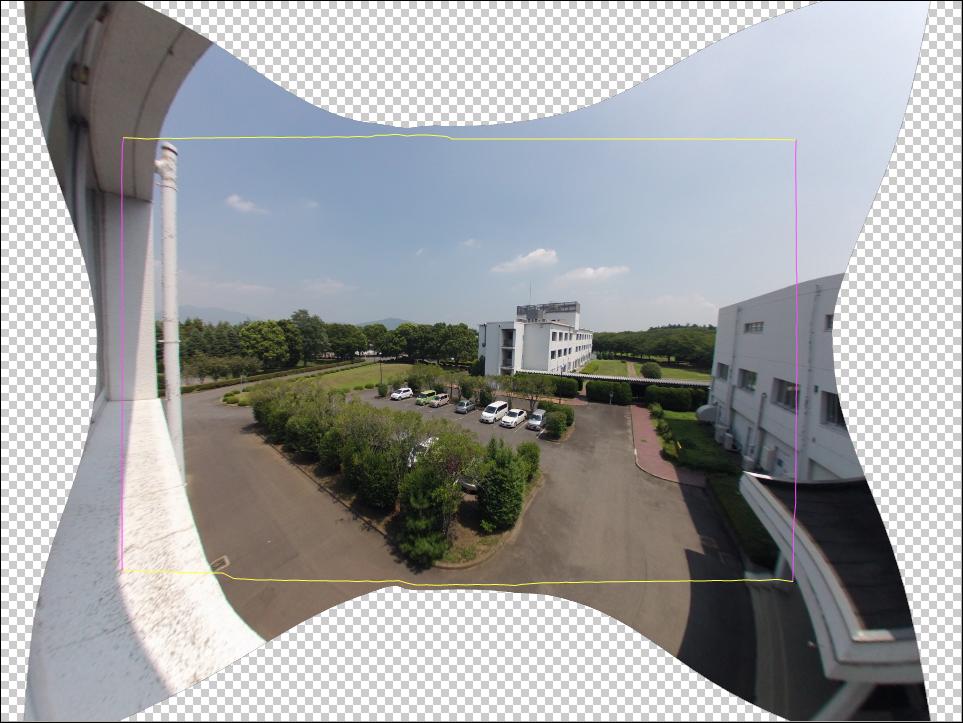

# 3. 写真測量のソース（写真画像）
写真測量成功のための重要ポイント：高品質かつ十分な数の写真を用意すること。解析に投入する一連の写真の品質で決定する。

## 3.1	高品質：以下の条件を満たす写真を撮影する
---
- カメラブレが無い  
- グラウンドスミア（GSDよりも移動速度が速い際に発生するブレ）が無い
- ピントが合っている
- 明部（ハイライト）が白飛びしていない（Fig.3.1）
-	暗部（シャドウ）が黒潰れしていない（Fig.3.2）
-	カメラ側で輪郭補正などの不要な処理が無いこと（Fig.3.3）
-	JPEG圧縮ノイズ（ブロック状のノイズ）が出ていない（Fig.3.4）
-	高感度すぎるISO設定によるノイズが出ていない（Fig.3.4）
-	解像度が高い：最低5Mpx。高画素すぎると別の問題も生じうる（後述）
-	適度な広角画像：27～50mm（35mm換算）程度がベスト（Fig.3.5, Fig.3.6）
-	撮影位置情報を持つ：GNSS等で計測された経緯度・標高
-	EXIF情報を持つ：f値、焦点距離
-	ビルトインレンズプロファイルが【適用されていない】こと（Fig.3.7左）
-	できればRAW形式で撮影された写真を使用する（Fig.3.7右）
-	画素の位置が変更になるようなレタッチを【行ってはならない】

  
Fig.3.1 明部（ハイライト）の情報が失われている（白飛び）  

   
Fig.3.1 白飛びした場合、RAW画像から明部（ハイライト）の情報を復元すること  

   
Fig.3.1 暗部（シャドウ）の情報が失われている（黒潰れ）

  
Fig.3.1 黒潰れした場合、RAW画像から暗部（シャドウ）の情報を復元すること

  
Fig.3.3 カメラ側の画像処理エンジンで行われる不要な画像処理のNG例。樹林のテクスチャーがべた塗りの水彩画のようになっている（GoPro3画像の等倍表示）。輪郭補正、超解像処理、様々な機能が提供されているが、写真測量には一切不要。全部オフにする。

  
Fig.3.4 ノイズが多い画像のNG例。ブロック状のJPEG圧縮ノイズ、高すぎるISOによる虹色粒状のノイズが画像全面に観察される。（GoPro2画像の等倍表示）

  
Fig.3.5 広角過ぎる画像のNG例：画角170度の超広角レンズにより、画像周辺が激しく変形している（GoPro2画像）

  
Fig.3.6 広角補正（レンズ歪み補正）の例：超広角レンズで撮影した画像に対しレンズ歪み補正をかけると、周辺は切り落とされる。残った画像のサイズはオリジナル画素数の半分以下に減少する。さらに、歪み補正処理によって画像の鮮明度（シャープネス、解像感）が低下する。オーバーラップ率も低下する。超広角レンズは撮影範囲が広くて魅力的に思える場合もあるが、写真測量の精度の面では、良いことは何も無い。
 　
  
Fig.3.7（左）ビルトインレンズプロファイルを適用しないこと

  
Fig.3.7（右）可能な限りRAW形式で記録すること

## 3.2	用意する写真の分量
---
撮影対象のサイズ、撮影距離、対象物の凹凸度に応じて以下の条件を満たすこと。いうまでもなく、写真に写っていない部分の3Dモデルを構築することはできない。
-	地形モデルを作成する場合は、垂直写真を撮影する。必要な写真のオーバーラップ（重複）率は進行方向、横方向ともに80%。
-	建物や石ころなどの3Dオブジェクトの場合は、対象物に対し平行移動で撮影する（Fig.3.8, 3.9）。あるいは、対象物を中心にカメラを回して撮影する（Fig.3.10, 3.11）。
-	対象物の凹部の内側の形状も再現したい場合は、写真のオーバーラップを高くする。撮影対象までの距離が近いほど、再現したい凹部が深いほど、高いオーバーラップ率で写真を撮影する必要がある
-	撮影位置を定位置に固定して、撮影方向だけを変えることはNG。画像間に視差が生じないため、モデル作成に失敗する。

   
Fig.3.8 建物を撮影する場合のカメラ位置。対象物に対して平行移動で撮影する。（建物屋上の構造物、長さ40m、高さ3m）

  
Fig.3.9 平面的なオブジェクトを撮影する場合のカメラ位置。オブジェクトに対して平行移動で撮影すること。（石碑、高さ1.5m、幅0.6m）

  
Fig.3.10 立体オブジェクトを撮影する場合のカメラ位置。対象物を中心に円を描くように上から下まで高密度に撮影する。（石像、高さ80cm）

  
Fig.3.11 立体オブジェクトを撮影する場合のカメラ位置。カメラを対象物に向けて円を描くように複数の角度から高密度に撮影する。（長径7cmの円礫）
