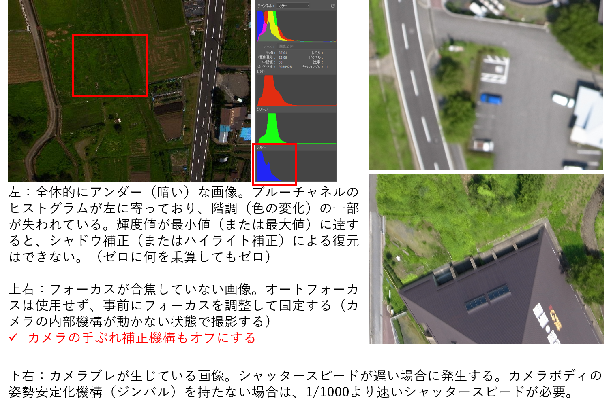

# ４.SfM技術Tips
**精度を向上させるための様々な配慮と工夫と基礎知識**

---

## 技術コラム(1) GCP品質の重要性 (1)
品質上の留意点：位置座標を正確に計測するだけでは不十分！
- SfM解析に使用する実際の写真画像上で、GCP設置地点が正確に読み取れること

## 技術コラム(1) GCP品質の重要性 (2-1)

地理院地図から読み取ることができる地点の正確さには限界がある

左：現場で選定したGCP地点を写真上で明確に特定できた  
右：地理院地図上では該当する地点を特定することができなかった。また、該当地域の最新のオルソ画像が公開されていなかった

## 技術コラム(1) GCP品質の重要性 (2-2)

地理院地図から読み取ることができる地点の正確さには限界がある

- 地理院地図で使用されている数値地形図の地図情報レベルは2500
- 標高値は5 mメッシュDEMまたは10 mメッシュDEM
- すなわち、水平精度、垂直精度ともに、メートル級の誤差を内包する
- 無人航空機で撮影したcm級の分解能を持つ写真には、地理院地図から読み取った地点の位置座標の誤差レンジは、そもそも大きすぎる

## 技術コラム(1) GCP品質の重要性 (3)
**理想的なGCPの配置**

理想的なGCP配置の基本（下図）
- 計測対象範囲の全域を地図化するための測量技術（市街地等を対象）

- UAV-SfM技術が必要とされる事態では、理想的なGCP配置を行うことは困難または不可能な場合がある（例：災害時、森林域、海・河川、ダム等の水域を含む領域、等）
- 立ち入りができない
- 緊急性が高く作業時間が短い
- GCPの代替になる人工物がない、あるいは設置できる環境ではない
- 地表面のテクスチャがほとんど無い
- 作業目的に適したGCPの設置と計測戦略の立案が必要

図　標定点の配置の事例  
出典：UAVを用いた公共測量マニュアル（案）、P35（国土交通省国土地理院、 2016.03）

## 技術コラム(2) アナログ空中写真の前処理

スキャニングしてデジタル化されたアナログ空中写真をSfM解析で使用する場合、同じカメラによる同じ撮影セットの写真について次の補正処理を行う  
- 指標を用いた画像の回転、主点位置合わせ、画像サイズ合わせ

※参考文献：Shoichiro Uchiyama and Toyohiko Miyagi (2014) Application of Digital Surface Model due to Structure from Motion. Proc. SATREPS 2014 Workshop “Landslide Risk Assessment Technology”, pp.128-136. Springer

## 技術コラム(3): SfM解析に使用してはならない写真集(1)

## 技術コラム(3): SfM解析に使用してはならない写真集(2)

## 技術コラム(4): 内部標定要素の推定：ビルトインレンズプロファイルの影響

## 技術コラム(5) 回析の影響

## 技術コラム(6)「分解能」とは

## 技術コラム(7)グラウンドスミアとは

撮像素子への露光時間中に地上分解能の半分を超えるカメラの移動が生じた場合に発生する画像のブレ  
例：巡航速度10 m/s、分解能0.04 m/画素におけるシャッタースピードと
　　グラウンドスミアの発生判定  
  - 1/125：10 (m/s) × 1/125 (s) = 移動距離 0.08 (m) → NG!
  - 1/250：10 (m/s) × 1/250 (s) = 移動距離 0.04 (m) → NG!
  - 1/500：10 (m/s) × 1/500 (s) = 移動距離 0.02 (m) → NG!
  - 1/1000：10 (m/s) × 1/1000 (s) =移動距離 0.01 (m) → OK

分解能が高いほど発生しやすい（以下の条件に該当する場合）  
  - 画素数の大きなカメラを使用  
  - より低空を飛行
  - より画角（FOV: Field of View）の狭いレンズを使用

画素数が多いことは、SfM解析にとって必ずしもベストではない
  - 飛行の制限条件が増える。より低速または高高度を飛行する必要が生じる
  - 高度を上げることができない場合、飛行速度が下がるため作業時間が長くなる
