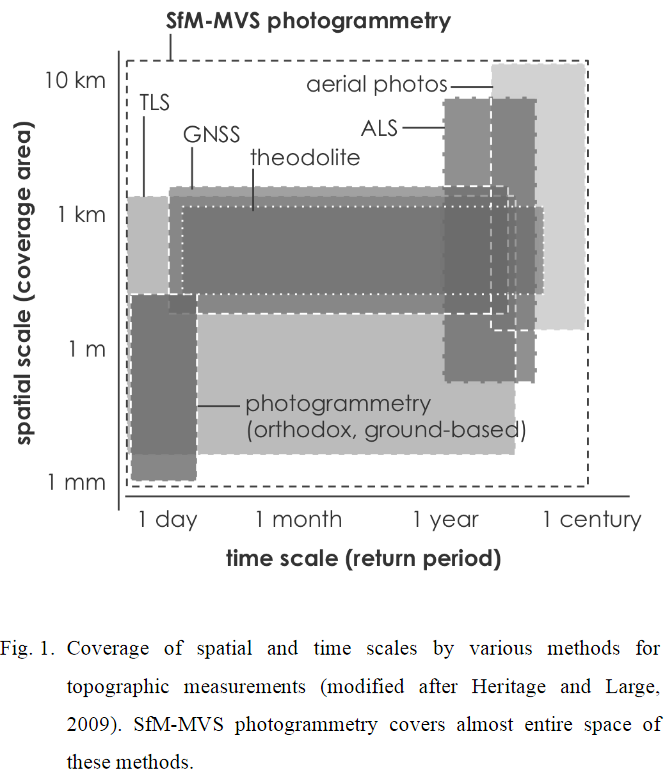

# 写真測量の特徴：レーザー測量との対比
　写真測量とレーザー測量は相補的な特徴を持ち、どちらがより優れているかという議論は適当ではない。それぞれの手法の特徴をよく把握し、適切な手法を選択する。

## 1. 情報を取得する手法の違い  
---
　写真測量は、レンズを通して撮像素子（CMOS等）に入射した物体からの可視光線の反射光をデジタル的に増幅して得られた画像（写真）を使用する。いわばPassiveなセンシング技術。写真測量、特にSfM写真測量では、画像中の「特徴点」を抽出し、隣接画像と共通の特徴点について、撮像素子とレンズ焦点位置から特徴点を通る光線の関係性を解析することにより、物体の立体形状を求める。つまり、SfM写真測量では十分な数の特徴点が得られることが必要条件となる。この条件を満たさない物体、つまり計測に向かない物体は、透明なもの、テクスチャーが弱い・ないもの（ex.ホワイトボード）、光沢が強いもの等が挙げられる。  
　レーザー測量では、計測装置からパルスレーザーを発射し、物体で後方散乱した反射波を受光し、物体までの距離と反射強度の情報を得る。いわば、Activeなセンシング技術。レーザー測量では、物体に対し直接レーザーを放射するため、物体表面のテクスチャーの有無はほとんど影響がない。

## 2. 取得できる情報の違い
---
　写真測量は、二枚の写真に写っている物体上の同じ点を、三角測量の原理で座標計測する。したがって、取得できる情報は、複数の写真に写っている対象物の計測値である。言い換えれば、写真に写っていない物体（例：森林の下の地面）や、複数の写真に写っていない（単体の写真にしか写っていない）物体については、計測を行うことはできないため、情報は得られない。また、可視光カメラを使用する場合は、夜間や暗い屋内など、環境光が十分ではない条件では計測（写真撮影）を行うことができない。  
　レーザー測量では、計測装置から放射したレーザー光が物体に反射して、計測装置に到達するまでの時間を計測する。この原理により、装置から物体までの距離情報を得る。一回のレーザー光の放射により、経路上の複数の物体からの反射波を得る。例えばレーザー光が樹冠の隙間を通過して地表面に到達した場合は、樹冠の天面および地表面までの距離の、少なくとも二つの距離情報を得ることができる。さらに、自らレーザーを照射するため、環境光の影響は少ない。ただし、霧や雲、水面など、レーザー光を吸収する物質で満たされている場合は計測することができない。回転ミラー等の装置でレーザー照射角を変化させることにより、ライン状に距離情報を取得する。また、航空機などの移動体に搭載する、あるいは装置そのものを水平に回転させることにより面的に走査する。

## 3. 情報の取得にかかる時間の違い
---
　いずれの手法も、計測や撮影の時間に加えて、解析や編集にかかる時間を要する。  
　写真測量では、一枚の写真撮影に要する時間は露光時間（シャッタースピード）に依存する。例えば、晴れの日の屋外であれば、露光時間は1/1600秒前後となる。写真測量では、対象物の三次元形状を求めるために、異なる位置から対象物を撮影した複数枚の写真を必要とする。カメラリグ（数個〜数百個のカメラが設置された設備）を使用すれば、多視点の写真を一回のシャッターで撮影することができるため、動く物体の計測も可能である。地形のように、対象物のサイズが大きく不動な場合は、航空機等で飛行しながら垂直直下方向の写真を撮影することで多視点の写真を撮影する。この場合は、情報の取得にかかる時間は長くなる。  
　レーザー測量では、装置から発射されるレーザーは1筋であるが、装置の内部にある回転ミラーを高速で動かすことにより、上下または左右方向について、連続的にレーザーの放射と反射波の受光を行う。装置を移動体（航空機や車両）に搭載し移動しながら計測を行うことにより、地表面をシームレスにスキャニングする。この場合、慣性航法装置等により、装置の三次元的な位置計測も同時に必要となる。地上レーザー測量の場合は、計測装置をゆっくりと回転させることにより水平方向をスキャニングする。写真のように一回のレーザー照射でシーン全体の情報を得ることができないため、動体の計測は難しい。

## 4. 解析にかかる時間の違い
---
　写真測量、特にSfM写真測量の場合は、使用する写真の総画素数と枚数、ワークステーションの計算性能に依存する。ハンズオンでは非常に高速な例として、400m四方を120秒程度でオルソモザイク画像まで作成するデモを行った。計測に使用するための精密な解析では、数時間から時に100時間を超える計算処理を必要とする。利用目的に応じて解析の時間コストの調整ができることも特徴である。  
　レーザー測量、特に地上レーザー測量の場合は、点群データの地上基準点へのジオリファレンス、地表面と乖離した位置に生じた計測点などのノイズフィルタリング、複数の地点から計測した点群の位置合わせを行うレジストレーションなどの作業を行う。

## 5. 精度の違い
---
　中距離（数百メートル）におけるSfM写真測量、地上レーザー測量では、同程度の分解能が期待できる。精度に関しては、いずれの計測手法も計測手法の技術的な原理のみを根拠とした単純比較はできない。原理的な誤差、計測環境に起因する誤差、地上基準点の座標計測誤差、観測技能による誤差のいずれもが、有意に最終的な精度に影響を与えることがその理由である。  
　計測手法の技術的・原理的な誤差として、例えば写真測量であれば、レンズ歪み補正の不完全さに起因するゆらぎ、レーザー測量であれば、レーザー光の入射角と後方散乱の関係による精度劣化や大気・距離による減衰がある。着目すべきは、どちらの手法であっても、必ずしも全域で一様の計測精度が保証されないことである。また、写真測量、レーザー測量ともに、地上基準点の座標計測誤差が強く影響する。技能による誤差要因として、写真測量であれば写真の品質、オーバーラップの取り方、地上基準点の設置の方法が影響する。レーザー測量では、機器の設置誤差、レジストレーション地点や地上基準点の設置方法が影響する。

出典：早川・小花和 (2016) 小型無人航空機を用いたSfM多視点ステレオ写真測量による地形情報の空中計測. 物理探査, 69 (4), 297-309. doi:10.3124/segj.69.297  
[http://www.csis.u-tokyo.ac.jp/~hayakawa/resources/Hayakawa_Obanawa_2016_UAS-SfM_ButsuriTansa.pdf](http://www.csis.u-tokyo.ac.jp/~hayakawa/resources/Hayakawa_Obanawa_2016_UAS-SfM_ButsuriTansa.pdf)

## 6. 導入にかかる初期コストの違い
---
　写真測量を行うには一般的に、1）対象物に対する多視点の写真、および2）写真内の地上基準点とその座標値を必要とする。近年は、民生用のデジタルカメラの高解像度化、GNSSの低価格化、無人航空機の普及とSfMソフトウェアのパッケージ化などによって、100万円未満の初期コストで、数cmの分解能を持つ地図成果（オルソモザイク画像、地表面標高モデル）を得ることができる。  
　航空レーザー測量の実施は、専門の機材と技術を保有する事業者に依頼する必要があり、コストも相応の大きさとなる。地上レーザー測量の機材は、数百万円〜3000万円程度であり、初期投資としては大きい。

## 7. 観測コスト、機動性、観測頻度の違い
---
　航空レーザー測量や航測カメラを使用した航空写真測量は外注による作業を行う必要があり、一回の観測コストは大きくなる。無人航空機を使用した写真測量や地上レーザー測量は、観測の度に必要な特別な費用は発生しないため、観測場所までの旅費を除外すれば、一回の計測コストは小さい。一回のデータ取得にかかるコストが低い手法であれば、定期的、あるいは頻回の観測や、イベント（豪雨、崩壊等）直後の機動的な観測が実施しやすい。計測コストの低さは、現実的な観測頻度となって現れる。UAVとSfM写真測量による観測や、地上レーザー測量のように、個人レベルで可搬・運用できる機材は機動性が高く、より高い観測頻度を実現しうる。これは、時間分解能の向上に寄与する

## 8. 機動性に影響を与える可搬性の問題
---
　加えて指摘するならば、観測機材の物流ネットワークによる輸送の可否は重要である。大手物流（日本郵便、ヤマト運輸、佐川急便）の標準的な最大荷物サイズは、3辺合計160cm、最大30kgであり、これを超える荷物の発送には制限が生じる。機材の梱包時のサイズを把握することは、観測機会の確保において現実問題として重要である。  
　無人航空機に限らず、大容量のリチウムポリマーバッテリーには、輸送や航空機搭載に関する制限がある。航空機や物流会社による輸送が法的に困難である場合、自分が運転する車で輸送する必要があり、機動性に大きく影響する。目安として、電圧（V）と容量（Ah）の積が100Whを超えるバッテリーは、輸送前に航空会社や運送会社に輸送の可否を確認する必要がある。  
　同様の観点で、海外での計測を行う場合は、輸送方法と所要時間、輸出入の可否、許可取得、相手国における関連法規（電波、航空、機器使用）等、いくつかの課題を解決する必要がある。
