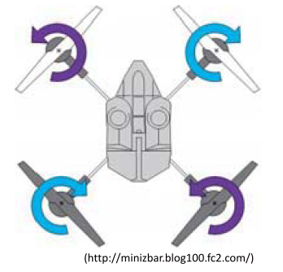
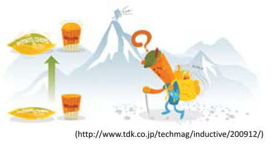

# 1.1.1. UAS, SfM多視点写真測量

## UAV
**U** nmanned **A** erial **V** ehicle
無人航空機（ドローン）

## UAS
**U** nmanned **A** ircraft **S** ystems
無人航空機システム

## SfM-MVS
**S** tructure **f** rom **M** otion
多視点画像からの三次元形状復元

## UAVとは何か
- 無人航空機全般のこと
- 様々な大きさ・機体あり

大きさ：約20~100 cm
重さ：約500～2000 g
価格：約5~100万円
※比較的安く、軽く、操縦が簡単
**⇒産業、研究、個人の趣味などで急速に普及**

## UAVのメカニズム
### 安定性が高い理由
#### 理由その１：プロペラが４つあること  
プロペラが１つ⇒プロペラと逆方向に機体が回る（反トルク）

プロペラが４つ⇒２つずつ逆方向に回転することで反トルクを打ち消す

#### 理由その２：GPSを内蔵しているため
グローバルポジショニングシステム(全地球測位システム）  
- 人工衛星からの距離をもとに自分の場所を知るシステム

ドローンは常に自分の場所を把握  
- 何も操作しないと、同じ場所に泊まる
- 風が吹いても自動的に場所を補正
- 飛行禁止場所には入れないよう事前に設定済み（空港周辺など）

ドローンは離陸場所を記憶
- 問題発生時は自動で帰還する

#### 理由その３：気圧高度計を内蔵しているため
高いところは気圧が下がる。
ドローンは気圧の変化から常に自分の高度を把握  
⇒一定高度の飛行が可能

#### 理由その４：磁気コンパスを内蔵しているため
地球全体は磁石のように磁気を持つ

ドローンは常に自分の向きを把握  
⇒姿勢の制御が可能

#### 理由その５：加速度計・ジャイロスコープ内蔵を内蔵しているため
ドローンは常に自分の進行方向と傾きを把握  
⇒姿勢の制御が可能

## 最近話題のUAV（ドローン
### 首相官邸無人機落下事件
2015年4月22日  
**総理大臣官邸屋上** で **小型無人機（ドローン）** が発見される。ドローンには小型カメラと茶色いプラスチック容器が搭載。容器の中から微量のセシウム由来の **放射線** が検出される。

2015年4月24日  
福井市在住の40際の男が犯人として自首。威力業務妨害の疑いによって逮捕。  
ドローンを鑑定に飛ばした動機は「反原発を訴えるため」。容器に入れたのは「福島の砂100g」。

### "ドローン少年"の逮捕
2015年5月9日  
長野市 **善光寺** の御開帳抱擁中、境内にドローンが落下。落下の1時間後、操縦していた **15歳の少年** が派出所に出頭。

2015年5月14日
**国会議事堂** 近くでドローンを飛ばそうとしていた少年を警察が任意同行。警察署員は少年を厳重注意し、保護者に引き渡す。

2015年5月21日
少年は浅草神社の **三社祭** でドローンを飛ばすとインターネット上に投稿。警視庁は威力業務妨害容疑で少年を逮捕。

## UAVの正しい活用に向けて
- 良い点
  - 政府としては積極的に **UAV活用を進める方針**
- 悪い点
  - 間違った使い方をすると **UAVは危険**

## 写真測量とは
写真の性質
- 近くのものは大きく、遠くのものは小さく映る
- 中央から離れるほど放射方向に倒れて移る
- 高さが高いほど倒れる量は大きくなる

写真の位置を変える  
⇒対象物の凹凸に応じて写真上で対象物の形が歪む  
⇒その歪みから対象物の凹凸を復元する

一般的な例：人間の両目

その他の身近な例：Nintendo 3DS

