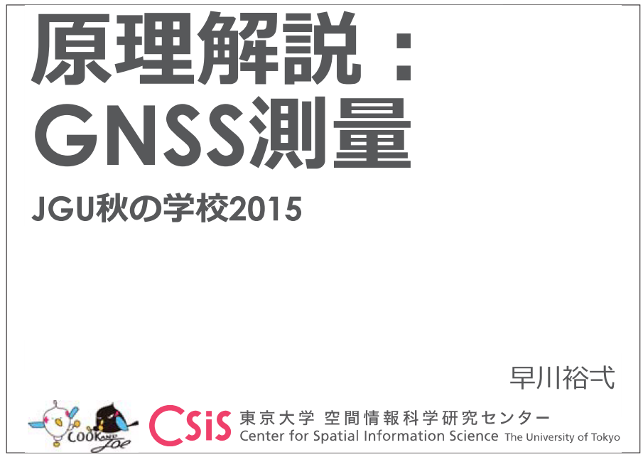
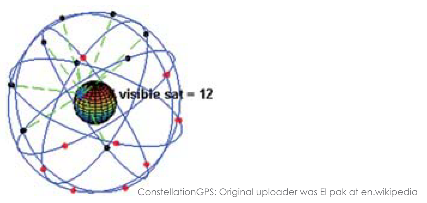
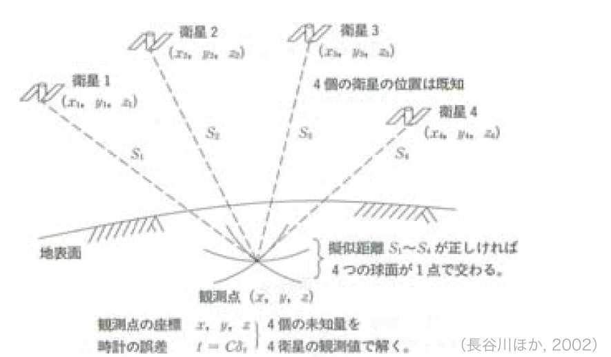
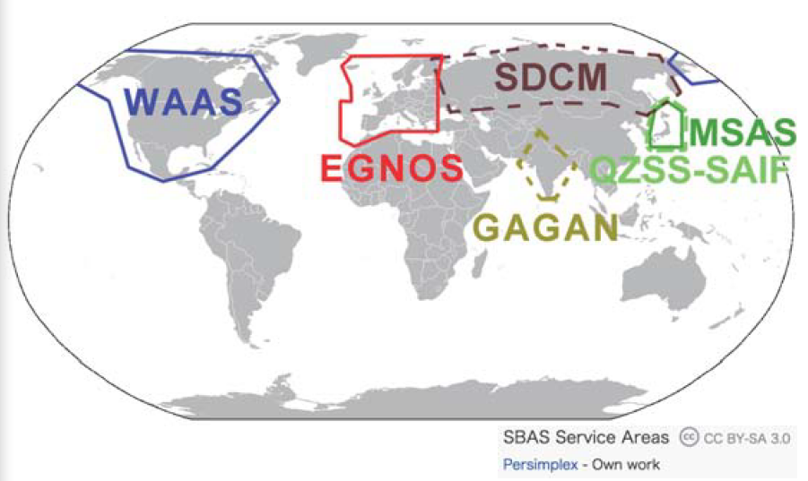

# GNSSの仕組み
## GNSS - <b>G</b>lobal <b>N</b> avigation <b>S</b>atellite <b>S</b>ystem
---
- 衛星からの電波を受信することにより、緯度・経度・高度の連続観測ができる**測位システム**
- GNSS：衛星測位のシステムの総称
  - GPS（アメリカ合衆国）、Galileo（ヨーロッパ連合）、GLONASS（ロシア）、北斗（中国、QZSS（日本）

## GPS - <b>G</b>lobal <b>P</b>ositioning <b>S</b>ystem  
---
1978  　　最初の測地衛生の打ち上げ  
1993  　　システムの正式運用  
1996  　　平和的民生利用への政策指針  
1998  　　GPS利用の日米協力推進体制  
2000 May  精度劣化操作（SA）の解除  
    現在：衛星数24個（予備含め約30個）  

## GNSSの基本構成
---

## GPS衛星からの電波信号
---
- 2種類の搬送波
  - L1帯：1,575.42 MHz
  - L2帯：1,227.6 MHz
- 測距信号
  - 混線防止と衛星識別のため、疑似ランダム雑音符号（PRN）により暗号化される
  - C/Aコード：L1波、民生用に開放
  - P(Y)コード：L1・L2波、米軍用に限定（観測は可能）
- 補正信号
  - SBAS (Satellite-Based Augmentation System)

## GNSS測量の分類と概要
---
|GNSS(GPS)測位法の種類|観測時間|成果課題|測位精度（水平方向）|適用領域|
|:---:|:---:|:---:|:---:|:---:|
|<b>単独即位</b>|数分～数秒|リアルタイム|10 m～|船・車などのナビゲーション|
|相対測位・<b>ディファレンシャル法</b>（DGNSS）|数秒～数分|リアルタイム/後処理|0.1～数 m|航空機のナビゲーション、船位測量、工事用車両の運行管理|
|相対測位・干渉測位・<b>スタティック法</b>|＞60分|後処理|5 mm|1～4級基準点測量、地すべり観測|
|相対測位・干渉測位・<b>短縮（高速）スタティック法</b>|10~20分|後処理|5 mm|3～4級基準点測量|
|相対測位・干渉測位・<b>後処理キネマティック法（PPK）</b>|＞1分|後処理|10-20 mm|3～4級基準点測量|
|相対測位・干渉測位・<b>リアルタイムキネマティック法（RTK）</b>|数秒～1分|リアルタイム|10～20 mm|3～4級基準点測量|

## GNSS受信機価格帯（JPY）
---
測位法|価格（JPY）|精度|
:---:|:---:|:---:
単独即位|数千～数万|101 m
ディファレンシャル即位|数十万|10-1～100 m
干渉測位（RTK, VRS, スタティック）|数百万|10-3～10-2 m

## 単独即位
---
- 1台の受信機を用いて同時に<b>4個以上</b>の衛星からの電波を受信
- 測点から各衛星までの距離  
⇒後方交会法によって観測点の位置を求める

## ディファレンシャル即位（DGPS）
---
- 複数の観測点（<b>基準局</b>と<b>移動局</b>で同時に単独即位を行い、肯定された基準局からの相対位置で移動局の誤差補正を行う。

## SBAS（Satellite-Based Augmentation System）
---
- 補正信号が**静止衛星**から送信される
  - <b>リアルタイム</b>なディファレンシャル即位
  - 精度：- 5 m程度
- 地域別に運用
  - 静止衛星であるため常時補足可能
  - 米国：WAAS（Wide Area Augmentation System）
  - EU：EGNOS（European Geostationary Navigation Overlay Service）
  - 日本：MSAS（MSTAT-based Satellite Augmentation System）＝ひまわり
- 航空機やハンディGPSにも搭載

## 各地域におけるSBASの運用
---
  
米国WAAS：2003年7月～  
日本MSAS：2007年9月～  
欧州GNSO：2005年～  
インドGAGAN：2013年以降

## 干渉測位
---
- 搬送波の**位相差**を利用する高精度測位法
- **基線解析**  
  - 2台の受信機（基地局・移動局）
  ⇒同時に受信した搬送波の位相差を測定
  - **基線ベクトル**（受信機間のの距離と方向）の算定
- 整数値バイアス
  - 位相差測定で読み取り可能なのは1波長未満だけで、整数部分は不確定
  - 観測開始時にこれの確定（**初期化**）が必要

## 干渉測位の種類
---
- 静的干渉測位（スタティック法）
  - 1時間以上の連続観測
    - 高速（短縮）スタティック法：10～20分
- 動的干渉測位（キネマティック法）
  - 初期化（整数値バイアスを決定・保存）後、後処理で基地局と移動局間の基線ベクトルを算出
    - 測点ごとの整数値バイアスの確定作業が不要
  - 各測点において数秒～1分程度に観測
  - **リアルタイムキネマティック（RTK）即位**
    - 基線解析のリアルタイム処理
    - 基地局と移動局間相互の無線通信
    （Bluetoothや携帯電話網（VRS）など）

## 電子基準点
---
- 国土地理院が全国約1,200箇所に設置しているGPS連続観測局
- 1994年～
- 地殻変動等の連続観測
- ディファンシャル/キネマティック補正のための基地局データを提供
  - 2015年6月29日リニューアル

## 準天頂衛星システム
---
- QZSS：Quasi-Zenith Satellite System
  - 宇宙航空研究開発機構（JAXA）
- 準天頂衛星初号機みちびき（QZS-1）
  - 2010年9月11日打ち上げ
- GPSの補完・補強
  - 常に天頂付近に衛星がある！
  - 補正信号⇒測位精度を高める
  - 目標精度
    - 高速移動体で１m以上
    - 低速移動帯で数cm

  
※参考URL：[http://www.jaxa.jp/projects/sat/qzss/](http://www.jaxa.jp/projects/sat/qzss/)
