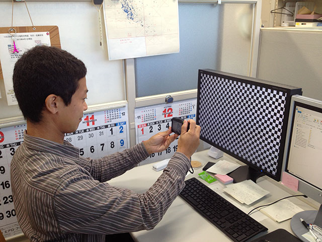
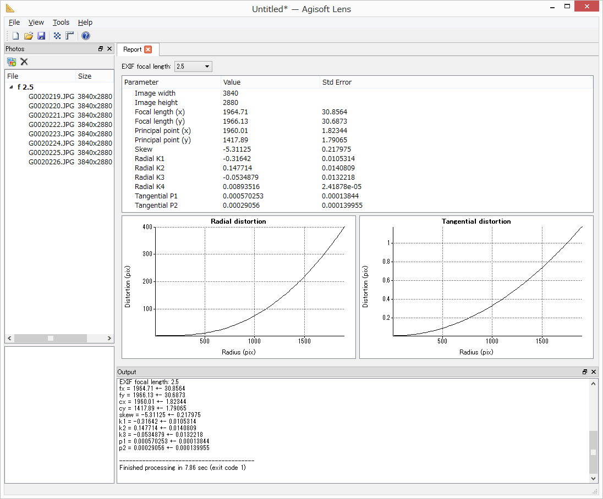
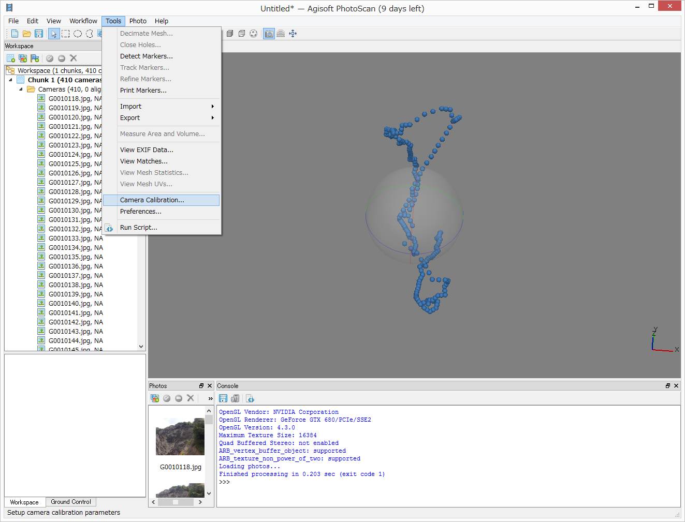
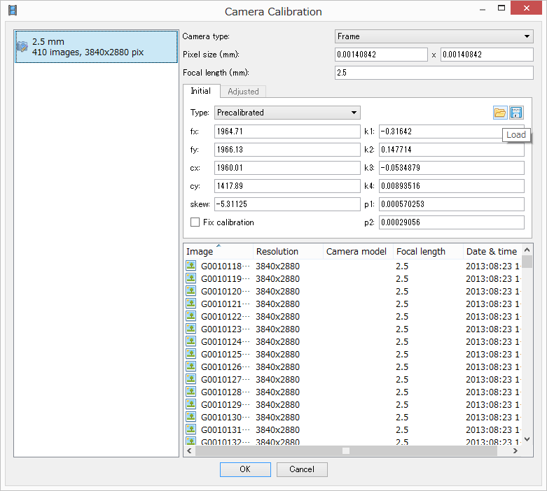
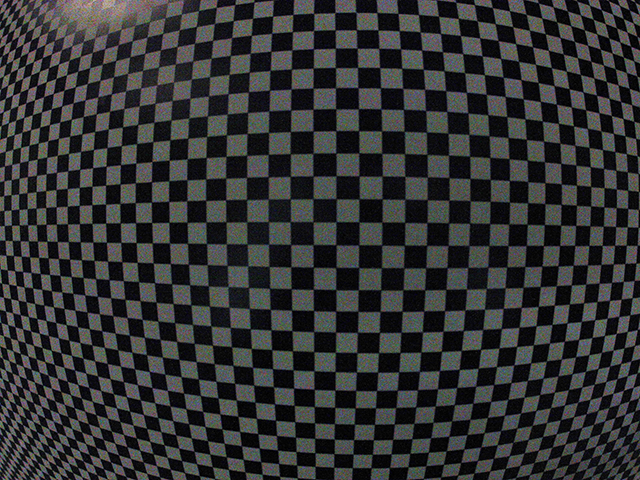

# 6.	Lens（レンズ歪み補正ソフトウェア）
　写真画像のレンズ歪みを除去するためのレンズ歪み補正パラメータを計算するソフトウェア「Lens」は無償で利用できる。このソフトウェアで手持ちのカメラのレンズ歪みを補正することで、より高精度な3Dモデルの構築が可能になる。以下にレンズ補正パラメータ取得までの流れを解説する。

## 1. Lensを起動する。
---

## 2.	Show chessboardをクリック。画面いっぱいに白黒の模様が表示される。
---

  
↑モニタに表示される模様↑

## 3.	空撮に使うカメラでモニタに表示されたChessboradをカメラの角度を僅かにずらしながら3枚以上撮影する。
---
画像は多ければ多いほど良い。20枚くらい撮影した。

  
↑撮影の様子↑

※画面の中央にレンズを据えて、左に少し振って一枚、正面に向けて一枚、右に少し振って一枚撮影する。枚数は多くても良い。  
※できるかぎり大きなモニタを使う。モニタが完全に平面であると仮定して、レンズゆがみを求めるため、液晶プロジェクターのスクリーン投影映像は使用できない。  
※モニタの枠が撮影画像に入っても問題ない  
※絞り値でレンズ特性が変わるため、絞りは空撮時と同じ設定にする  
※同じくレンズ特性が変わるため、マクロモードにしない
※手ぶれしないこと  
※蛍光灯や外の光がモニタに反射しない環境で撮影すること  
※Chessboradを、液晶プロジェクタスクリーンなどの歪みのある物体に表示しないこと  
※ズームレンズは、鏡筒が動かないようにガムテープ等で固定する  
※品番が同じでも個体が違えば、異なるレンズパラメータを持つ。それぞれ独立して計測する必要がある  
※オーバーホールに出すなど、レンズ・CMOSの構造に触れる作業を行った場合は、再度、計測を行う  
※ビルトインレンズプロファイルが適用されない写真を使用すること。RAW形式がベスト  

## 4.	以下の例では、6枚の画像を撮影した。
---

## 5.	撮影した画像をLensに追加（Add Photos）する。
---

## 6.	撮影した画像をLensに追加した状態。
---

## 7.	この状態で「Calibrate」をクリック
---

## 8. すべてチェックを入れてOKをクリックするとレンズ補正パラメータの計算（推定）が始まる。
---

## 9	レンズ補正パラメータの推定計算が終了すると、radial distortion（樽型歪み）、 円周方向歪み（tangential distortion）のグラフなどが表示される。
---

## 10. 「File」コマンド-「Save calibration」をクリックし、任意の場所に補正パラメータを保存する。
---

※PhotoScan用の補正パラメータは「Save calibration」から保存すること。「Save」や「Save as..」では、PhotoScan用のファイル形式にならない。

## 11.	PhotoScan用の補正パラメータファイル（.xml形式）。PhotoScanではこのファイルを読み込む。
---

## 12.	PhotoScanを起動し、写真画像を読み込んだ後に補正パラメータを読み込む。
---
「Tools」-「Camera Calibration.」

## 13.	「Load」アイコンをクリックし、レンズ補正パラメータを読み込む。Typeが「Precaliblated」になれば成功。OKをクリックして完了。

## 14. 補正効果の確認
---
　PhotoScanでは、Lensで作成したレンズ補正パラメータで歪みを除去した写真画像を出力できる。これによって、レンズ補正が行われているかどうかを確認できる。  
　歪み補正したい写真画像を読み込み、レンズ補正パラメータを読み込んだ状態で「Align Photos（AccuracyはLowで良い）」処理を実行する。「Align Photos」処理を行うまでは歪み除去済み画像を出力することはできない。  
　次に、「Tools」-「Export」-「Undistort Photos」を選択し、オプション全てにチェックを入れて出力先フォルダを選択する。

  
歪み補正前（オリジナル）の写真画像  
（ゆがみ補正効果の例のためにGoPro2を使用, 画角Medium）

  
Lensで作成した補正パラメータによる歪み補正後の写真画像。赤い線を見ると、画像の中央および周辺部においても、歪んでいたチェッカーボードが補正され、正しい幾何学模様を示していることがわかる。ただし、チェッカーボードの縞模様の数はオリジナルより少ない。画像補正によって周辺部が切り捨てられている。
