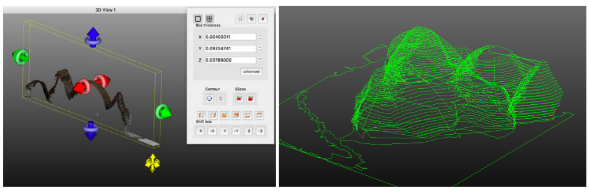

# LEVEL 1 基本操作
## 表示の調整・変更
* 3Dビューの表示
	* 回転
		* 左マウスを押しながら
	* 移動
		* 右マウスを押しながら
	* ズーム
		* マウスホイール
		* +/= キー

* 点サイズの変更
	* 3Dビューの左上の"―　+"
	* プロパティの "Point size"（点群ごと）

## データベースの操作
* データベースの表示
	* エンティティ（対象レイヤ）の選択
		* データベースツリーで左クリック
		* または3Dビューで対象を左クリック
	* 表示のオン・オフ
		* DBツリーのチェックボックス
			* 下位レイヤもオフ
		* プロパティの‘Visible’ボタン
			* 対象レイヤのみオフ

* エンティティ（レイヤ）の変更
	* 新しいグループの作成
		* データベースツリー > 右クリック
	* エンティティ（レイヤ）の名称変更
		* F2 or ダブルクリック

## 色表示の変更

## セグメンテーション（手動）
* 対象エンティティ（レイヤ）の選択
* ツールの開始（はさみアイコン）
	* Edit > Segment
* 線で囲む
	* 多角形 or 四角
	* 左クリック：新規頂点
	* 右クリック：線を閉じる
	* 作業の一時停止可能 →視点を変えて再開
	* 線の保存・読出可
* セグメント・イン or アウト
	* セグメント後は一時停止状態 → ☑で確定

## リサンプリング　subsumpling
点群のデータ量削減、一定の点密度
* 対象エンティティ（レイヤ）の選択
* ツール開始
	* Edit > Subsample
* リサンプル方法の選択
	* ランダム
	* 点間隔（space）
		* 最小点間距離の指定
	* 八分木（octree）
* 新規点群が生成される

※cf. 点密度の計算：Tools > Other > Density

## 色、法線の編集
* Edit > Colors
	* 単一色の設定（Unique or Colorize）
	* 高さ（Z値）での色分け Height Ramp
	* RGBヒストグラムの調整
	* グレースケールへの変換
	* スカラー値への変換
		* 色情報の計算（NDVIやGRVIなど）
* Edit > Normals
	* 法線の計算
	* 法線方向の反転
	* 法線方向の調整（Orient normals）
	* 法線→HSV色空間への変換
	* Dip / Dip direction スカラー値への変換

## スケーリング
* Edit > Multiply / Scale
	* スケール変更

## クローン、マージ
* Edit > Clone
	* エンティティの複製  
	★“UNDO”機能代替：やり直しが効く！
* Edit > Merge
	* 2つ以上のエンティティを統合（点群とメッシュのみ対応）

## 断面抽出
* Tools > Segmentation > Cross Section
	* 対話的または一括処理（スライス）
	* 等値線の抽出（ポリライン）

## 手動座標変換 transformation
* 視点の変更 « front » view

* 点群を選択しツールを開始
 	* Edit > Translate / Rotate
* 対象エンティティのみ軸が変更
	* 回転軸の選択（Zのみ、など）
	* 作業の一時停止可能

