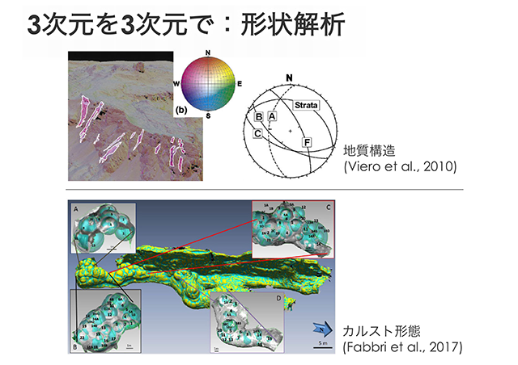
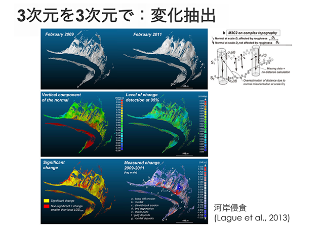

# 基本事項の解説

## 点群データとは？

## CloudCompareとは？
* 開発者: Daniel Girardeau-Montaut（フランス）
* CloudCompare V1
	- 2004-2006
	- TLS点群の変化抽出（CADメッシュや他の点群との比較）
* CloudCompare V2
	- 2007: 社内開発
	- 2009/2010: オープンソース化 (V2.1)
* 点群処理の”十徳ナイフ”
	- 2016: CloudCompare V2.8
* 詳細は、[Wiki](http://www.cloudcompare.org/doc/wiki)を参照

## ccViewer

