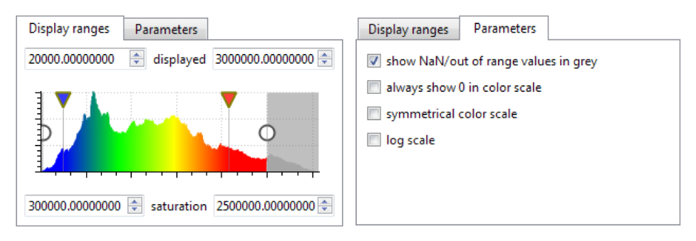

# スカラー値

## スカラー値
* 1点ごとに付与される値
* 様々な数値
  * 距離
  * 反射強度
  * 点密度
  * 表面粗度
  * 誤差
  * 曲率
  * 温度
  * 時間 etc.
* 様々な色表示が可能

## スカラー値でできること
* 算術演算（+, -, /, x, cos, log, …）
* フィルタ（抽出、スムージング、変化量, …）
* 座標値（XYZ）から入力、座標値へ出力
* RGBカラーへの変換（もしくは合算）
* 統計解析
  * ヒストグラム、平均、標準偏差
* スカラー値に基づく抽出
  * Edit > SF > Filter by value
  * リサンプリング時のオプション
* ASCIIファイル（CSV）への出力
  * → Excel, Matlab, etc.スカラー値の表示

## スカラー値の表示
* 色表示の柔軟な調整
  * 選択エンティティのプロパティで編集
  * リアルタイムでの表示更新
* 点群ごとにスカラー値の数（種類）は無制限

## カラースケール編集
« Color Scale Editor »
* カラースケールをカスタマイズ（編集、新規作成）
  * Edit > Scalar fields > Color Scale Manager
* XMLファイルへの入出力
* BINファイルにも保存

