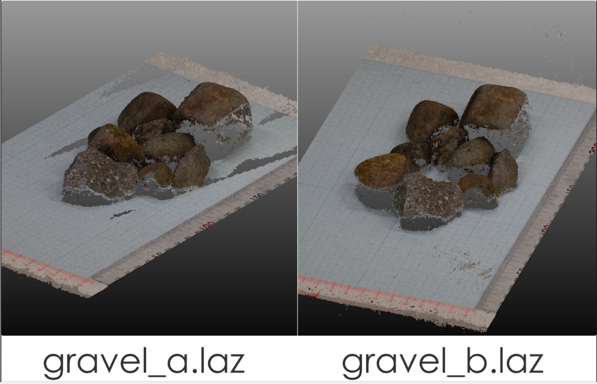

# レジストレーション

## 2つの点群の読み込み

## 点群の位置合わせ方法
* 手作業での移動（不正確）
* 対照点に基づく位置合わせ
* 自動位置合わせ
（**ICP**: Iterative Closeset Point）
  * 事前におおまかに位置合わせができている前提

## 対照点に基づく位置合わせ
* 二つの点群を選択（Shift+クリック）
  * Tools > Registration >  Align (point pairs picking)
* gravel_aを基準（Reference）に ←Swap
* 同一の点を4～6箇所選択（左クリック）
  * 特徴的な点（物の角など）を選択
  * なるべく点群全体、広範囲、Z方向にも様々に
  * 移動と基準の点群をそれぞれ個別に表示し、同じ順で特徴点を選択
* show ‘to align’ cloud / show ‘reference’ cloud
  * 視点変更・ズームインなどでなるべく正確に選択
  * ただし、あとで自動位置合わせをする前提では大まかでもOK

* ‘align’をクリック→結果のプレヴュー
* エラーの確認
  * エラーの大きい点の除去、他の対照点の追加  
  ☑→確定
  * RMSの表示
* その他オプション
  * ‘adjust scale’：スケールを変更してもよい場合
  * ‘Rotation’：軸を固定可能（水平が取れている等）
  * 外部の参照点（GCP）座標も入力可能

## 自動位置合わせ（ICP）
* 二つの点群を選択（Shift+クリック）
  * Tools > Registration >  Fine registration (ICP)
* gravel_aを基準（Reference）に ←Swap
* “overlap” 変化を加味して80%

* 「不変箇所」のみに適用
  * 複製（！）
  * セグメンテーション後の点群でICP
  * →変換行列を元の点群に適用する

* 変換行列（Transformation Matrix）
  * プロパティ画面
  * Export > Clipboard

* 変換前の元の点群を読込
  * gravel_b.laz
* 変換行列を適用する
  * Edit > Apply transformation > clipboard

