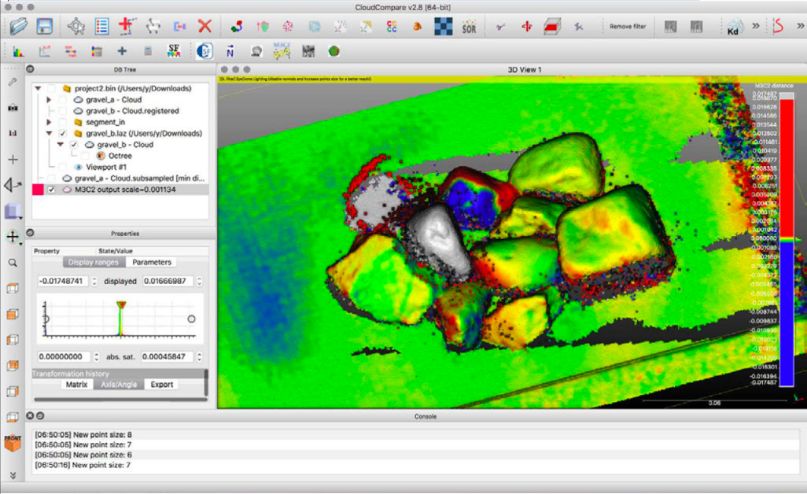

# 距離計算

## 点群間距離 cloud-to-cloud distances
* 二つの点群を選択（Shift+クリック）
  * Tools > Distances > Cloud/Cloud Dist.
* gravel_aを基準（Reference）に ←Swap
* パラメータ設定
  * max. distance = 0.05 m
  * split X, Y,and Z  
  components: YES
  * → « Compute »
    * →　OK

## 点群間距離の算出方法 C2C distance
* デフォルトでは、比較される点群の各点について、基準点群の最近隣の点までの距離が算出される
  * →対称的ではない  
  ＝基準と比較を入れ替えると結果も若干異なる

## C2C distances のコンセプト
* 基準となる点群が充分に高密度であれば、比較点群で算出される最近隣の点との距離は、実際の距離に近くなる
* 理論：TLSによる点群はポアソン分布に従う
  * 誤差は点群密度に依存する
* 基準点群は高密度である必要がある
* 基準点群は比較点群の領域を充分にカバーする必要がある

## 基準点群が高密度でない場合は？
* "Local modeling"  
基準点群を補間（補完）するモデルを生成

## 距離のヒストグラム表示
* gravel_bを選択、ヒストグラムを表示
  * Edit > Scalar fields > Show histogram
  * →<1 mm の値に集中
* 余分な値を除外
  * Edit > Scalar fields > Filter by value
  * [0.001 0.05] >> Export
- 出力した点群でSFのヒストグラムを表示
  - プロパティのカラースケールで色変更可能
  - X, Y, Z各方向の値（Split有効時）

## M3C2プラグイン

## M3C2距距離離
* 二つの点群を選択（Shift+クリック）
  * Plugins > M3C2 distance
- パラメータ設定
  - Cloud #1: gravel_a, Cloud #1: gravel_b
  - “Guess params”
  - subsample cloud #1: 0.0004 (= 0.4 mm)
  - Registration error: 0.001 (= 1 mm)
  - Normals: default

## M3C2距離 gravel_a

## M3C2距離 gravel_b

## M3C2距離 M3C2 distance output

## M3C2距離 normal dip [0–90°°]

## M3C2距離 normal dip direction [0-360°°]

