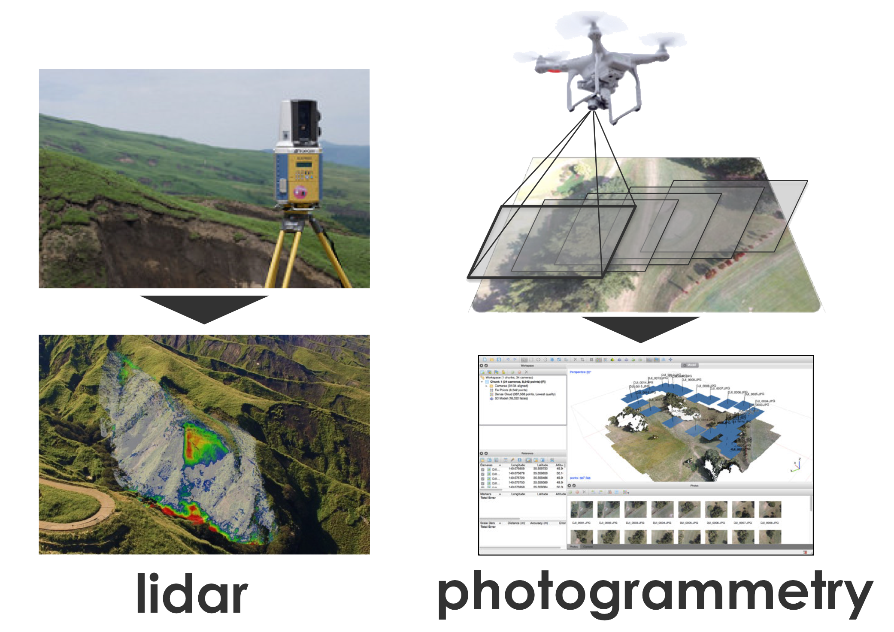
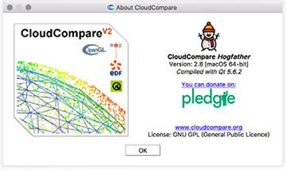

# 基本事項の解説

## 点群データとは？
* 3次元の位置情報をもつ点の集合。  
* レーザ測量（Lidar: light detection and ranging）や写真測量、パターン照射のセンシングなどにより得られる。  
* 色情報（RGB）やレーザ反射強度などの属性値も付加可能。

## 点群データの利点
* 点群データの利点のひとつに、3次元（XYZ）の位置や形状を、3次元のまま扱えることが挙げられる。
 * cf. DEM（digital elevation model）は平面に準拠しており、いわゆる"2.5次元"。
* 点群データの解析には大きく二つの目的が挙げられる。
 1. 形状解析 
 2. 変化抽出（時系列解析）

#### 形状解析の例
* 詳細な3次元形状の解析ができる。

#### 変化抽出の例
* 詳細で3次元的な変化箇所を抽出、定量化することができる。

## CloudCompareとは？
[http://www.danielgm.net/cc/](http://www.danielgm.net/cc/)

* 開発者: [Daniel Girardeau-Montaut](https://www.linkedin.com/in/daniel-girardeau-montaut-8a0b4a1/)
* CloudCompare V1
	- 2004-2006
	- TLS点群の変化抽出（CADメッシュや他の点群との比較）
* CloudCompare V2
	- 2007: 社内開発
	- 2009/2010: オープンソース化 (V2.1)
* 点群処理の”十徳ナイフ”
	- 2016: CloudCompare V2.8
* ccViewer：軽量、多彩なファイルタイプに対応、簡単な計測も可能なヴューア。
* 詳細は、[Wiki](http://www.cloudcompare.org/doc/wiki)を参照

## references
* Fabbri S, Sauro F, Santagata T, et al (2017) High-resolution 3-D mapping using terrestrial laser scanning as a tool for geomorphological and speleogenetical studies in caves: An example from the Lessini mountains (North Italy). Geomorphology 280:16–29. doi: 10.1016/j.geomorph.2016.12.001
* Lague D, Brodu N, Leroux J (2013) Accurate 3D comparison of complex topography with terrestrial laser scanner: Application to the Rangitikei canyon (N-Z). ISPRS J Photogramm Remote Sens 82:10–26. doi: 10.1016/j.isprsjprs.2013.04.009
* * Viero A, Teza G, Massironi M, et al (2010) Laser scanning-based recognition of rotational movements on a deep seated gravitational instability: The Cinque Torri case (North-Eastern Italian Alps). Geomorphology 122:191–204. doi: 10.1016/j.geomorph.2010.06.014
